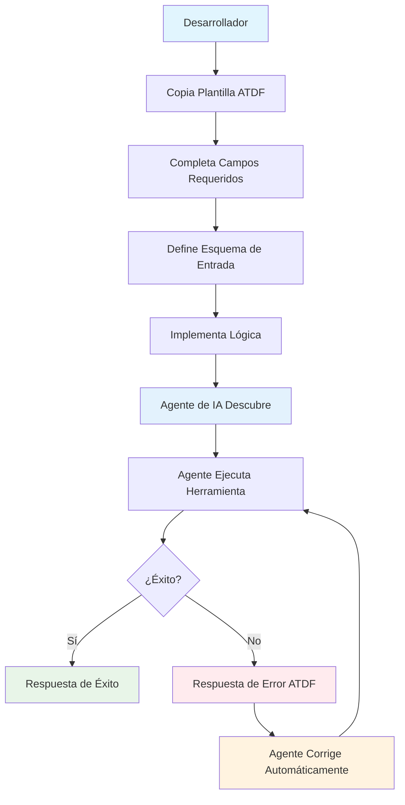
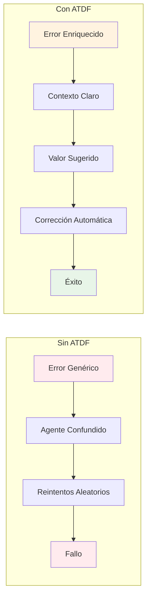

# ⚠️ Advertencia sobre recarga automática en Windows / WatchFiles

**ESPAÑOL:**

> ⚠️ **IMPORTANTE:** Si ejecutas el servidor FastAPI con `--reload` en Windows/MINGW64, puedes experimentar bucles infinitos de recarga y errores de importación ("Could not import module ...") debido a un bug conocido de WatchFiles cuando hay muchos archivos de ejemplo o test cambiando. 
>
> **Solución recomendada:** Arranca el servidor SIN recarga automática (`uvicorn ... --no-reload`) para desarrollo y producción. Si necesitas recarga, limita la opción `--reload-dir` solo a la carpeta de código fuente, nunca a `examples/` ni a carpetas con tests o scripts cambiantes.

**ENGLISH:**

> ⚠️ **IMPORTANT:** If you run the FastAPI server with `--reload` on Windows/MINGW64, you may experience infinite reload loops and import errors ("Could not import module ...") due to a known WatchFiles bug when many example or test files are changing.
>
> **Recommended solution:** Start the server WITHOUT auto-reload (`uvicorn ... --no-reload`) for both development and production. If you need reload, use the `--reload-dir` option to limit it only to your source code folder, never to `examples/` or folders with tests or frequently changing scripts.

---

# Arranque rápido / Quick Start

1. **Selecciona el esquema / Pick a schema**
   - 1.x básico (`schema/atdf_schema.json`): descripciones mínimas con `tool_id`, `description`, `when_to_use` y `how_to_use`.
   - 2.x mejorado (`schema/enhanced_atdf_schema.json`): añade `metadata`, `localization`, `prerequisites`, `examples` y `feedback`.
   Consulta la guía de [Compatibilidad de versiones](./docs/en/version_compatibility.md) para elegir.

2. **Redacta la descripción / Draft the descriptor**

```json
{
  "schema_version": "2.0.0",
  "tool_id": "date_validator",
  "description": "Valida rangos de fechas y devuelve errores enriquecidos",
  "when_to_use": "Usa la herramienta cuando necesites validar fechas con detalles de corrección",
  "how_to_use": {
    "inputs": [
      {"name": "start_date", "type": "string", "description": "Fecha inicial ISO 8601", "required": true},
      {"name": "end_date", "type": "string", "description": "Fecha final ISO 8601", "required": true}
    ],
    "outputs": {
      "success": "El rango es válido",
      "failure": [
        {"code": "INVALID_DATE_RANGE", "description": "La fecha inicial debe ser menor que la final"}
      ]
    }
  },
  "metadata": {"version": "1.0.0", "author": "ATDF Team"},
  "examples": [
    {
      "name": "Rango válido",
      "input": {"start_date": "2025-01-01", "end_date": "2025-01-15"}
    }
  ]
}
```

Ajusta los campos según la complejidad de tu herramienta. Para un descriptor 1.x usa `schema_version` = `"1.0.0"` y omite `metadata` y `examples`.

3. **Valida y prueba / Validate and test**

```bash
python tools/validator.py tu_tool.json --schema schema/atdf_schema.json
python tools/validate_enhanced.py tu_tool.json
atdf validate tu_tool.json --smart
```

Ejecuta `python tests/run_all_tests.py` para validar todo el SDK y ejemplos si modificas código.# Agent Tool Description Format (ATDF)

## 🎯 ¿Qué es ATDF?

El **Agent Tool Description Format (ATDF)** es un estándar abierto para describir herramientas de agentes de IA y manejar respuestas de error de manera estandarizada. ATDF proporciona **plantillas y especificaciones agnósticas al código** que funcionan independientemente del lenguaje de programación, framework o herramienta utilizada.

## 🌟 Características Principales

### 📋 **Descripción Estandarizada de Herramientas**
- **Plantillas JSON reutilizables** para describir herramientas
- Esquemas de entrada con validación automática
- Metadatos enriquecidos y ejemplos de uso
- Compatible con cualquier agente de IA

### 🚨 **Manejo de Errores Enriquecido**
- **Plantillas de error estandarizadas** con contexto
- Valores sugeridos para corrección automática
- Tipos de error específicos y descriptivos
- Información detallada para debugging

### 🔄 **Interoperabilidad Universal**
- **Independiente de lenguaje, framework o herramienta**
- Funciona con código (Python, JavaScript, Java, etc.)
- Funciona con herramientas no-code (N8N, Zapier, etc.)
- Fácil integración con sistemas existentes
- Extensible para casos de uso específicos
- Compatible con estándares web (JSON Schema, OpenAPI)

## 📖 Documentación

### 📚 **Documentación Principal**
- **[Especificación ATDF](./docs/ATDF_SPECIFICATION.md)** - Especificación completa del formato
- **[Guía de Implementación](./docs/IMPLEMENTATION_GUIDE.md)** - Cómo implementar ATDF en cualquier herramienta
- **[Mejores Prácticas](./docs/BEST_PRACTICES.md)** - Recomendaciones para implementaciones robustas
- **[Ejemplos](./docs/examples.md)** - Ejemplos en múltiples lenguajes y herramientas
- **[Compatibilidad de versiones](./docs/en/version_compatibility.md)** - Relación entre las versiones históricas (v0.1/v0.2) y los esquemas actuales (1.x/2.x).
- **[Flujo ATDF + MCP + n8n](./docs/atdf_mcp_n8n_integration_flow.md)** - Arquitectura y guías paso a paso en varios idiomas.

## 🔌 Integraciones Destacadas`r`n`r`n- **n8n + MCP + ATDF**: sigue la [guía de integración](./docs/atdf_mcp_n8n_integration_flow.md) para conectar el bridge ATDF-MCP y ejecutar herramientas desde n8n (nodos nativos o personalizados).`r`n- **Bridge ATDF-MCP local**:`r`n  ```bash`r`n  python examples/fastapi_mcp_integration.py`r`n  python examples/mcp_atdf_bridge.py --port 8001 --atdf-server http://localhost:8000`r`n  ````r`n`r`n## 🎯 Plantillas ATDF

### 1. **Plantilla de herramienta (esquema 1.x)**

```json
{
  "schema_version": "1.0.0",
  "tool_id": "tool_name",
  "description": "Resumen claro de la herramienta",
  "when_to_use": "Cuándo debe invocarse",
  "how_to_use": {
    "inputs": [
      {"name": "parametro1", "type": "string", "description": "Descripción del parámetro", "required": true}
    ],
    "outputs": {
      "success": "Mensaje de éxito",
      "failure": [
        {"code": "ERROR_CODE", "description": "Descripción del error"}
      ]
    }
  }
}
```

### 2. **Plantilla de herramienta (esquema 2.x)**

```json
{
  "schema_version": "2.0.0",
  "tool_id": "tool_name",
  "description": "Resumen con los beneficios clave",
  "when_to_use": "Escenarios recomendados",
  "how_to_use": {
    "inputs": [
      {"name": "parametro1", "type": "string", "description": "Descripción del parámetro", "required": true},
      {"name": "parametro2", "type": "integer", "description": "Valores permitidos", "minimum": 1, "maximum": 100, "required": true}
    ],
    "outputs": {
      "success": "Mensaje de éxito",
      "failure": [
        {"code": "ERROR_CODE", "description": "Descripción del error"}
      ]
    }
  },
  "metadata": {"version": "1.2.0", "author": "Equipo ATDF", "tags": ["categoria1", "categoria2"]},
  "prerequisites": {"permissions": ["scope:write"]},
  "examples": [
    {
      "name": "Caso básico",
      "input": {"parametro1": "valor", "parametro2": 10}
    }
  ]
}
```

### 3. **Plantilla de respuesta de error ATDF**

```json
{
  "status": "error",
  "data": {
    "code": "INVALID_DATE_RANGE",
    "message": "Date range validation failed",
    "details": {
      "field": "date_range",
      "received": {"start_date": "2025-01-20", "end_date": "2025-01-10"},
      "expected": {
        "conditions": [
          "start_date must be before end_date",
          "dates must be in the future"
        ],
        "examples": {
          "valid_range": {"start_date": "2025-01-05", "end_date": "2025-01-12"}
        }
      },
      "solution": "Adjust the dates so start_date < end_date and both are in the future"
    }
  },
  "meta": {"timestamp": "2025-01-01T10:00:00Z"}
}
```

## 🔧 Tipos de Error Estándar

| Tipo | URI | Descripción | Uso |
|------|-----|-------------|-----|
| Validation Error | `https://api.example.com/errors/validation-error` | Errores de validación de entrada | Parámetros inválidos |
| Invalid Date | `https://api.example.com/errors/invalid-date` | Fechas inválidas | Fechas en el pasado |
| Invalid Route | `https://api.example.com/errors/invalid-route` | Rutas inválidas | Origen = destino |
| Business Rule | `https://api.example.com/errors/business-rule` | Reglas de negocio | Límites de capacidad |
| Authentication | `https://api.example.com/errors/authentication` | Errores de autenticación | Credenciales inválidas |
| Authorization | `https://api.example.com/errors/authorization` | Errores de autorización | Permisos insuficientes |

## 🚀 Cómo Usar las Plantillas ATDF

### 1. **Definir Descripción de Herramienta**
Copia la plantilla ATDF y completa los campos:

```json
{
  "tools": [
    {
      "name": "hotel_reservation",
      "description": "Make a hotel reservation with validation",
      "inputSchema": {
        "type": "object",
        "properties": {
          "guest_name": {"type": "string", "description": "Guest name"},
          "email": {"type": "string", "format": "email"},
          "check_in": {"type": "string", "format": "date-time"},
          "check_out": {"type": "string", "format": "date-time"},
          "room_type": {"type": "string", "enum": ["single", "double", "suite"]},
          "guests": {"type": "integer", "minimum": 1, "maximum": 4}
        },
        "required": ["guest_name", "email", "check_in", "check_out", "room_type", "guests"]
      }
    }
  ]
}
```

### 2. **Definir Respuesta de Error**
Usa la plantilla ATDF para errores:

```json
{
  "errors": [
    {
      "type": "https://api.example.com/errors/invalid-date",
      "title": "Invalid Check-in Date",
      "detail": "Check-in date cannot be in the past",
      "instance": "/api/errors/e62aa61e-d844-4761-82c3-531a070fb139",
      "tool_name": "hotel_reservation",
      "parameter_name": "check_in",
      "suggested_value": "2025-01-15T12:00:17.148869",
      "context": {
        "current_time": "2025-01-15T12:00:17.148869",
        "provided_date": "2025-01-14T10:00:00Z"
      }
    }
  ]
}
```

### 3. **Respuestas Completas ATDF**

#### Respuesta de Éxito
```json
{
  "reservation_id": "123e4567-e89b-12d3-a456-426614174000",
  "status": "confirmed",
  "message": "Hotel reservation created successfully",
  "details": {
    "guest_name": "John Doe",
    "email": "john.doe@example.com",
    "check_in": "2025-01-15T14:00:00Z",
    "check_out": "2025-01-17T12:00:00Z",
    "room_type": "double",
    "guests": 2,
    "total_price": 299.99,
    "confirmation_number": "HTL-2025-001234"
  }
}
```

#### Respuesta de Error (Múltiples Errores)
```json
{
  "errors": [
    {
      "type": "https://api.example.com/errors/invalid-date",
      "title": "Invalid Check-in Date",
      "detail": "Check-in date cannot be in the past",
      "instance": "/api/errors/e62aa61e-d844-4761-82c3-531a070fb139",
      "tool_name": "hotel_reservation",
      "parameter_name": "check_in",
      "suggested_value": "2025-01-15T12:00:17.148869",
      "context": {
        "current_time": "2025-01-15T12:00:17.148869",
        "provided_date": "2025-01-14T10:00:00Z"
      }
    },
    {
      "type": "https://api.example.com/errors/validation-error",
      "title": "Invalid Email Format",
      "detail": "Email address format is invalid",
      "instance": "/api/errors/f73bb62f-e955-4872-93d4-642181082240",
      "tool_name": "hotel_reservation",
      "parameter_name": "email",
      "suggested_value": "john.doe@example.com",
      "context": {
        "provided_value": "invalid-email",
        "validation_rule": "email_format"
      }
    }
  ]
}
```

#### Respuesta de Error (Regla de Negocio)
```json
{
  "errors": [
    {
      "type": "https://api.example.com/errors/business-rule",
      "title": "Room Not Available",
      "detail": "Selected room type is not available for the requested dates",
      "instance": "/api/errors/g84cc73g-f066-5983-04e5-753292193351",
      "tool_name": "hotel_reservation",
      "parameter_name": "room_type",
      "suggested_value": "single",
      "context": {
        "requested_room_type": "suite",
        "available_room_types": ["single", "double"],
        "check_in": "2025-01-15T14:00:00Z",
        "check_out": "2025-01-17T12:00:00Z"
      }
    }
  ]
}
```

### 3. **Implementar en tu Herramienta**
Las plantillas funcionan en cualquier herramienta:

#### **Herramientas No-Code**:
- **[N8N](./docs/examples.md#n8n-workflow)**
- **[Zapier](./docs/examples.md#zapier-automation)**
- **[Make (Integromat)](./docs/examples.md#make-integromat)**

#### **Lenguajes de Programación**:
- **[Python (FastAPI)](./docs/examples.md#fastapi-python)**
- **[JavaScript (Express.js)](./docs/examples.md#expressjs-nodejs)**
- **[Java (Spring Boot)](./docs/examples.md#spring-boot-java)**
- **[C# (ASP.NET Core)](./docs/examples.md#aspnet-core-c)**

## 🎯 Casos de Uso

### 🤖 **Agentes de IA**
- Descripción estandarizada de herramientas
- Manejo automático de errores
- Corrección automática con valores sugeridos
- Integración con cualquier agente compatible

### 🔌 **APIs y Microservicios**
- Formato de error consistente
- Documentación automática
- Validación de entrada estandarizada
- Interoperabilidad entre servicios

### 🛠️ **Herramientas de Desarrollo**
- Generación automática de documentación
- Testing estandarizado
- Monitoreo y logging consistente
- Debugging mejorado

### 🔄 **Automatización No-Code**
- Workflows estandarizados en N8N
- Integraciones consistentes en Zapier
- Manejo de errores uniforme
- Documentación automática

## 🔒 Tooling interno (BMAD)

BMAD-METHOD es un framework que usamos únicamente para coordinar tareas del equipo ATDF. No forma parte del protocolo ATDF ni de los entregables públicos, así que puedes ignorarlo si solo te interesa adoptar ATDF.

- El equipo interno puede consultar `README_BMAD.md` y `docs/BMAD_INTEGRATION.md` para procedimientos y scripts.
- Los recursos `bmad/`, `install_bmad.*` y comandos `npm run bmad:*` se conservan como apoyo interno.
- Usuarios externos no necesitan instalar ni ejecutar BMAD para trabajar con ATDF.


## 📊 Beneficios

| Beneficio | Descripción |
|-----------|-------------|
| **Interoperabilidad** | Funciona con cualquier agente de IA o sistema |
| **Estandarización** | Formato consistente independiente de la implementación |
| **Contexto Enriquecido** | Errores con información detallada para corrección |
| **Extensibilidad** | Fácil de extender para casos de uso específicos |
| **Mantenibilidad** | Código más limpio y fácil de mantener |
| **No-Code Friendly** | Funciona perfectamente con herramientas visuales |
| **Calidad Automatizada** | Testing y validación automática con agentes especializados |

## 🔗 Enlaces Útiles

- **[Documentación Completa](https://mauricioperera.github.io/agent-tool-description-format/)**
- **[Repositorio GitHub](https://github.com/MauricioPerera/agent-tool-description-format)**
- **[Especificación ATDF](./docs/ATDF_SPECIFICATION.md)**
- **[Ejemplos de Implementación](./docs/examples.md)**
- **[Guía de Implementación](./docs/IMPLEMENTATION_GUIDE.md)**

## 📄 Licencia

Este proyecto está bajo la Licencia MIT. Ver el archivo [LICENSE](LICENSE) para más detalles.

## 🚀 ¿Cómo Funciona ATDF?

### Flujo Completo de Trabajo


### Comparación: Sin ATDF vs Con ATDF

