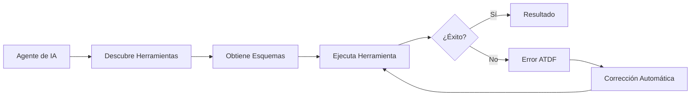

# Agent Tool Description Format (ATDF)

## 🎯 ¿Qué es ATDF?

El **Agent Tool Description Format (ATDF)** es un estándar abierto para describir herramientas de agentes de IA y manejar respuestas de error de manera estandarizada. ATDF proporciona un formato JSON consistente que funciona independientemente del lenguaje de programación o framework utilizado.

## 🌟 Características Principales

### 📋 **Descripción Estandarizada de Herramientas**
- Formato JSON consistente para describir herramientas
- Esquemas de entrada con validación automática
- Metadatos enriquecidos y ejemplos de uso
- Compatible con cualquier agente de IA

### 🚨 **Manejo de Errores Enriquecido**
- Respuestas de error estandarizadas con contexto
- Valores sugeridos para corrección automática
- Tipos de error específicos y descriptivos
- Información detallada para debugging

### 🔄 **Interoperabilidad Universal**
- Independiente de lenguaje y framework
- Fácil integración con sistemas existentes
- Extensible para casos de uso específicos
- Compatible con estándares web (JSON Schema, OpenAPI)

## 📖 Documentación

### 📚 **Documentación Principal**
- **[Especificación ATDF](./docs/ATDF_SPECIFICATION.md)** - Especificación completa del formato
- **[Guía de Implementación](./docs/IMPLEMENTATION_GUIDE.md)** - Cómo implementar ATDF en cualquier lenguaje
- **[Mejores Prácticas](./docs/BEST_PRACTICES.md)** - Recomendaciones para implementaciones robustas
- **[Ejemplos](./docs/EXAMPLES.md)** - Ejemplos en múltiples lenguajes y frameworks

### 🎯 **Conceptos Fundamentales**

#### Descripción de Herramientas
```json
{
  "tools": [
    {
      "name": "hotel_reservation",
      "description": "Make a hotel reservation with validation",
      "inputSchema": {
        "type": "object",
        "properties": {
          "guest_name": {"type": "string", "description": "Guest name"},
          "email": {"type": "string", "format": "email"},
          "check_in": {"type": "string", "format": "date-time"},
          "check_out": {"type": "string", "format": "date-time"},
          "room_type": {"type": "string", "enum": ["single", "double", "suite"]},
          "guests": {"type": "integer", "minimum": 1, "maximum": 4}
        },
        "required": ["guest_name", "email", "check_in", "check_out", "room_type", "guests"]
      }
    }
  ]
}
```

#### Respuestas de Error ATDF
```json
{
  "errors": [
    {
      "type": "https://api.example.com/errors/invalid-date",
      "title": "Invalid Check-in Date",
      "detail": "Check-in date cannot be in the past",
      "instance": "/api/errors/e62aa61e-d844-4761-82c3-531a070fb139",
      "tool_name": "hotel_reservation",
      "parameter_name": "check_in",
      "suggested_value": "2025-01-15T12:00:17.148869",
      "context": {
        "current_time": "2025-01-15T12:00:17.148869",
        "provided_date": "2025-01-14T10:00:00Z"
      }
    }
  ]
}
```

## 🚀 Implementación Rápida

### 1. **Instalar Dependencias**
```bash
pip install fastapi uvicorn pydantic
```

### 2. **Crear Herramienta ATDF**
```python
from fastapi import FastAPI
from pydantic import BaseModel
import uuid
from datetime import datetime

app = FastAPI()

# Definir herramienta
HOTEL_TOOL = {
    "name": "hotel_reservation",
    "description": "Make a hotel reservation",
    "inputSchema": {
        "type": "object",
        "properties": {
            "guest_name": {"type": "string"},
            "email": {"type": "string", "format": "email"},
            "check_in": {"type": "string", "format": "date-time"},
            "check_out": {"type": "string", "format": "date-time"},
            "room_type": {"type": "string", "enum": ["single", "double", "suite"]},
            "guests": {"type": "integer", "minimum": 1, "maximum": 4}
        },
        "required": ["guest_name", "email", "check_in", "check_out", "room_type", "guests"]
    }
}

@app.get("/tools")
async def get_tools():
    return {"tools": [HOTEL_TOOL]}

@app.post("/api/hotel/reserve")
async def reserve_hotel(request: dict):
    # Validar fecha de llegada
    check_in = datetime.fromisoformat(request["check_in"].replace("Z", "+00:00"))
    if check_in < datetime.now():
        return {
            "errors": [{
                "type": "https://api.example.com/errors/invalid-date",
                "title": "Invalid Check-in Date",
                "detail": "Check-in date cannot be in the past",
                "instance": f"/api/errors/{uuid.uuid4()}",
                "tool_name": "hotel_reservation",
                "parameter_name": "check_in",
                "suggested_value": datetime.now().isoformat(),
                "context": {"current_time": datetime.now().isoformat()}
            }]
        }
    
    return {
        "reservation_id": str(uuid.uuid4()),
        "status": "confirmed",
        "message": "Hotel reservation created successfully"
    }
```

### 3. **Ejecutar Servidor**
```bash
uvicorn main:app --reload --port 8000
```

## 🔧 Ejemplos por Lenguaje

### Python (FastAPI)
```python
# Ver ejemplos completos en docs/EXAMPLES.md
```

### JavaScript (Express.js)
```javascript
// Ver ejemplos completos en docs/EXAMPLES.md
```

### Java (Spring Boot)
```java
// Ver ejemplos completos en docs/EXAMPLES.md
```

### C# (ASP.NET Core)
```csharp
// Ver ejemplos completos en docs/EXAMPLES.md
```

## 🎯 Casos de Uso

### 🤖 **Agentes de IA**
- Descripción estandarizada de herramientas
- Manejo automático de errores
- Corrección automática con valores sugeridos
- Integración con cualquier agente compatible

### 🔌 **APIs y Microservicios**
- Formato de error consistente
- Documentación automática
- Validación de entrada estandarizada
- Interoperabilidad entre servicios

### 🛠️ **Herramientas de Desarrollo**
- Generación automática de documentación
- Testing estandarizado
- Monitoreo y logging consistente
- Debugging mejorado

## 📊 Beneficios

| Beneficio | Descripción |
|-----------|-------------|
| **Interoperabilidad** | Funciona con cualquier agente de IA o sistema |
| **Estandarización** | Formato consistente independiente de la implementación |
| **Contexto Enriquecido** | Errores con información detallada para corrección |
| **Extensibilidad** | Fácil de extender para casos de uso específicos |
| **Mantenibilidad** | Código más limpio y fácil de mantener |
| **Documentación** | Documentación automática y actualizada |

## 🔄 Flujo de Trabajo ATDF



## 🛠️ Herramientas y SDKs

### 📦 **SDKs Oficiales**
- [Python SDK](./sdk/python/) - SDK completo para Python
- [JavaScript SDK](./sdk/javascript/) - SDK para Node.js y navegador
- [Java SDK](./sdk/java/) - SDK para Java y Spring Boot

### 🔧 **Herramientas de Desarrollo**
- [ATDF Validator](./tools/validator/) - Validador de esquemas ATDF
- [ATDF Generator](./tools/generator/) - Generador de código
- [ATDF Playground](./tools/playground/) - Entorno de pruebas

## 🤝 Contribuir

### 📝 **Cómo Contribuir**
1. Fork el repositorio
2. Crea una rama para tu feature (`git checkout -b feature/nueva-funcionalidad`)
3. Commit tus cambios (`git commit -am 'Agregar nueva funcionalidad'`)
4. Push a la rama (`git push origin feature/nueva-funcionalidad`)
5. Crea un Pull Request

### 📚 **Documentación**
- [Guía de Contribución](./docs/contributing.md)
- [Código de Conducta](./CODE_OF_CONDUCT.md)
- [Changelog](./CHANGELOG.md)

## 📄 Licencia

Este proyecto está licenciado bajo la [Licencia MIT](./LICENSE).

## 🔗 Enlaces Útiles

- **[Especificación Completa](./docs/ATDF_SPECIFICATION.md)**
- **[Ejemplos de Implementación](./docs/EXAMPLES.md)**
- **[Mejores Prácticas](./docs/BEST_PRACTICES.md)**
- **[FAQ](./docs/faq.md)**
- **[Changelog](./CHANGELOG.md)**
- **[Documentación Online](https://mauricioperera.github.io/agent-tool-description-format/)**

## 📞 Soporte

- 📖 **Documentación**: [https://mauricioperera.github.io/agent-tool-description-format/](https://mauricioperera.github.io/agent-tool-description-format/)
- 🐛 **Issues**: [GitHub Issues](https://github.com/MauricioPerera/agent-tool-description-format/issues)
- 📚 **Repositorio**: [https://github.com/MauricioPerera/agent-tool-description-format](https://github.com/MauricioPerera/agent-tool-description-format)

---

**ATDF** - Estandarizando la descripción de herramientas para agentes de IA 🚀
