# ⚠️ Advertencia sobre recarga automática en Windows / WatchFiles

**ESPAÑOL:**

> ⚠️ **IMPORTANTE:** Si ejecutas el servidor FastAPI con `--reload` en Windows/MINGW64, puedes experimentar bucles infinitos de recarga y errores de importación ("Could not import module ...") debido a un bug conocido de WatchFiles cuando hay muchos archivos de ejemplo o test cambiando. 
>
> **Solución recomendada:** Arranca el servidor SIN recarga automática (`uvicorn ... --no-reload`) para desarrollo y producción. Si necesitas recarga, limita la opción `--reload-dir` solo a la carpeta de código fuente, nunca a `examples/` ni a carpetas con tests o scripts cambiantes.

**ENGLISH:**

> ⚠️ **IMPORTANT:** If you run the FastAPI server with `--reload` on Windows/MINGW64, you may experience infinite reload loops and import errors ("Could not import module ...") due to a known WatchFiles bug when many example or test files are changing.
>
> **Recommended solution:** Start the server WITHOUT auto-reload (`uvicorn ... --no-reload`) for both development and production. If you need reload, use the `--reload-dir` option to limit it only to your source code folder, never to `examples/` or folders with tests or frequently changing scripts.

---

# Arranque rápido / Quick Start

**Windows:**

```bat
run_fastapi_no_reload.bat
```

**Linux/Mac:**

```sh
chmod +x run_fastapi_no_reload.sh
./run_fastapi_no_reload.sh
```

Esto arrancará el servidor FastAPI en modo seguro, sin recarga automática, en el puerto 8000.

# Agent Tool Description Format (ATDF)

## 🎯 ¿Qué es ATDF?

El **Agent Tool Description Format (ATDF)** es un estándar abierto para describir herramientas de agentes de IA y manejar respuestas de error de manera estandarizada. ATDF proporciona **plantillas y especificaciones agnósticas al código** que funcionan independientemente del lenguaje de programación, framework o herramienta utilizada.

## 🌟 Características Principales

### 📋 **Descripción Estandarizada de Herramientas**
- **Plantillas JSON reutilizables** para describir herramientas
- Esquemas de entrada con validación automática
- Metadatos enriquecidos y ejemplos de uso
- Compatible con cualquier agente de IA

### 🚨 **Manejo de Errores Enriquecido**
- **Plantillas de error estandarizadas** con contexto
- Valores sugeridos para corrección automática
- Tipos de error específicos y descriptivos
- Información detallada para debugging

### 🔄 **Interoperabilidad Universal**
- **Independiente de lenguaje, framework o herramienta**
- Funciona con código (Python, JavaScript, Java, etc.)
- Funciona con herramientas no-code (N8N, Zapier, etc.)
- Fácil integración con sistemas existentes
- Extensible para casos de uso específicos
- Compatible con estándares web (JSON Schema, OpenAPI)

## 📖 Documentación

### 📚 **Documentación Principal**
- **[Especificación ATDF](./docs/ATDF_SPECIFICATION.md)** - Especificación completa del formato
- **[Guía de Implementación](./docs/IMPLEMENTATION_GUIDE.md)** - Cómo implementar ATDF en cualquier herramienta
- **[Mejores Prácticas](./docs/BEST_PRACTICES.md)** - Recomendaciones para implementaciones robustas
- **[Ejemplos](./docs/examples.md)** - Ejemplos en múltiples lenguajes y herramientas

## 🎯 Plantillas ATDF

### 1. **Plantilla de Descripción de Herramienta**

#### Estructura Básica
```json
{
  "tools": [
    {
      "name": "string",
      "description": "string",
      "inputSchema": {
        "type": "object",
        "properties": {},
        "required": []
      }
    }
  ]
}
```

#### Plantilla Completa con Metadatos
```json
{
  "tools": [
    {
      "name": "nombre_herramienta",
      "description": "Descripción clara de lo que hace la herramienta",
      "version": "1.0.0",
      "tags": ["categoria1", "categoria2"],
      "inputSchema": {
        "type": "object",
        "properties": {
          "parametro1": {
            "type": "string",
            "description": "Descripción del parámetro",
            "minLength": 1
          },
          "parametro2": {
            "type": "integer",
            "minimum": 1,
            "maximum": 100,
            "description": "Descripción del parámetro"
          }
        },
        "required": ["parametro1", "parametro2"]
      },
      "examples": [
        {
          "name": "Ejemplo básico",
          "input": {
            "parametro1": "valor_ejemplo",
            "parametro2": 10
          }
        }
      ]
    }
  ]
}
```

### 2. **Plantilla de Respuesta de Error ATDF**

#### Estructura de Error
```json
{
  "errors": [
    {
      "type": "string",
      "title": "string",
      "detail": "string",
      "instance": "string",
      "tool_name": "string",
      "parameter_name": "string",
      "suggested_value": "string|null",
      "context": "object"
    }
  ]
}
```

#### Plantilla de Error con Contexto
```json
{
  "errors": [
    {
      "type": "https://api.example.com/errors/tipo-error",
      "title": "Título del Error",
      "detail": "Descripción detallada del problema",
      "instance": "/api/errors/uuid-unico",
      "tool_name": "nombre_herramienta",
      "parameter_name": "parametro_problematico",
      "suggested_value": "valor_sugerido",
      "context": {
        "informacion_adicional": "valor",
        "timestamp": "2025-01-15T12:00:00Z"
      }
    }
  ]
}
```

## 🔧 Tipos de Error Estándar

| Tipo | URI | Descripción | Uso |
|------|-----|-------------|-----|
| Validation Error | `https://api.example.com/errors/validation-error` | Errores de validación de entrada | Parámetros inválidos |
| Invalid Date | `https://api.example.com/errors/invalid-date` | Fechas inválidas | Fechas en el pasado |
| Invalid Route | `https://api.example.com/errors/invalid-route` | Rutas inválidas | Origen = destino |
| Business Rule | `https://api.example.com/errors/business-rule` | Reglas de negocio | Límites de capacidad |
| Authentication | `https://api.example.com/errors/authentication` | Errores de autenticación | Credenciales inválidas |
| Authorization | `https://api.example.com/errors/authorization` | Errores de autorización | Permisos insuficientes |

## 🚀 Cómo Usar las Plantillas ATDF

### 1. **Definir Descripción de Herramienta**
Copia la plantilla ATDF y completa los campos:

```json
{
  "tools": [
    {
      "name": "hotel_reservation",
      "description": "Make a hotel reservation with validation",
      "inputSchema": {
        "type": "object",
        "properties": {
          "guest_name": {"type": "string", "description": "Guest name"},
          "email": {"type": "string", "format": "email"},
          "check_in": {"type": "string", "format": "date-time"},
          "check_out": {"type": "string", "format": "date-time"},
          "room_type": {"type": "string", "enum": ["single", "double", "suite"]},
          "guests": {"type": "integer", "minimum": 1, "maximum": 4}
        },
        "required": ["guest_name", "email", "check_in", "check_out", "room_type", "guests"]
      }
    }
  ]
}
```

### 2. **Definir Respuesta de Error**
Usa la plantilla ATDF para errores:

```json
{
  "errors": [
    {
      "type": "https://api.example.com/errors/invalid-date",
      "title": "Invalid Check-in Date",
      "detail": "Check-in date cannot be in the past",
      "instance": "/api/errors/e62aa61e-d844-4761-82c3-531a070fb139",
      "tool_name": "hotel_reservation",
      "parameter_name": "check_in",
      "suggested_value": "2025-01-15T12:00:17.148869",
      "context": {
        "current_time": "2025-01-15T12:00:17.148869",
        "provided_date": "2025-01-14T10:00:00Z"
      }
    }
  ]
}
```

### 3. **Respuestas Completas ATDF**

#### Respuesta de Éxito
```json
{
  "reservation_id": "123e4567-e89b-12d3-a456-426614174000",
  "status": "confirmed",
  "message": "Hotel reservation created successfully",
  "details": {
    "guest_name": "John Doe",
    "email": "john.doe@example.com",
    "check_in": "2025-01-15T14:00:00Z",
    "check_out": "2025-01-17T12:00:00Z",
    "room_type": "double",
    "guests": 2,
    "total_price": 299.99,
    "confirmation_number": "HTL-2025-001234"
  }
}
```

#### Respuesta de Error (Múltiples Errores)
```json
{
  "errors": [
    {
      "type": "https://api.example.com/errors/invalid-date",
      "title": "Invalid Check-in Date",
      "detail": "Check-in date cannot be in the past",
      "instance": "/api/errors/e62aa61e-d844-4761-82c3-531a070fb139",
      "tool_name": "hotel_reservation",
      "parameter_name": "check_in",
      "suggested_value": "2025-01-15T12:00:17.148869",
      "context": {
        "current_time": "2025-01-15T12:00:17.148869",
        "provided_date": "2025-01-14T10:00:00Z"
      }
    },
    {
      "type": "https://api.example.com/errors/validation-error",
      "title": "Invalid Email Format",
      "detail": "Email address format is invalid",
      "instance": "/api/errors/f73bb62f-e955-4872-93d4-642181082240",
      "tool_name": "hotel_reservation",
      "parameter_name": "email",
      "suggested_value": "john.doe@example.com",
      "context": {
        "provided_value": "invalid-email",
        "validation_rule": "email_format"
      }
    }
  ]
}
```

#### Respuesta de Error (Regla de Negocio)
```json
{
  "errors": [
    {
      "type": "https://api.example.com/errors/business-rule",
      "title": "Room Not Available",
      "detail": "Selected room type is not available for the requested dates",
      "instance": "/api/errors/g84cc73g-f066-5983-04e5-753292193351",
      "tool_name": "hotel_reservation",
      "parameter_name": "room_type",
      "suggested_value": "single",
      "context": {
        "requested_room_type": "suite",
        "available_room_types": ["single", "double"],
        "check_in": "2025-01-15T14:00:00Z",
        "check_out": "2025-01-17T12:00:00Z"
      }
    }
  ]
}
```

### 3. **Implementar en tu Herramienta**
Las plantillas funcionan en cualquier herramienta:

#### **Herramientas No-Code**:
- **[N8N](./docs/examples.md#n8n-workflow)**
- **[Zapier](./docs/examples.md#zapier-automation)**
- **[Make (Integromat)](./docs/examples.md#make-integromat)**

#### **Lenguajes de Programación**:
- **[Python (FastAPI)](./docs/examples.md#fastapi-python)**
- **[JavaScript (Express.js)](./docs/examples.md#expressjs-nodejs)**
- **[Java (Spring Boot)](./docs/examples.md#spring-boot-java)**
- **[C# (ASP.NET Core)](./docs/examples.md#aspnet-core-c)**

## 🎯 Casos de Uso

### 🤖 **Agentes de IA**
- Descripción estandarizada de herramientas
- Manejo automático de errores
- Corrección automática con valores sugeridos
- Integración con cualquier agente compatible

### 🔌 **APIs y Microservicios**
- Formato de error consistente
- Documentación automática
- Validación de entrada estandarizada
- Interoperabilidad entre servicios

### 🛠️ **Herramientas de Desarrollo**
- Generación automática de documentación
- Testing estandarizado
- Monitoreo y logging consistente
- Debugging mejorado

### 🔄 **Automatización No-Code**
- Workflows estandarizados en N8N
- Integraciones consistentes en Zapier
- Manejo de errores uniforme
- Documentación automática

## 📊 Beneficios

| Beneficio | Descripción |
|-----------|-------------|
| **Interoperabilidad** | Funciona con cualquier agente de IA o sistema |
| **Estandarización** | Formato consistente independiente de la implementación |
| **Contexto Enriquecido** | Errores con información detallada para corrección |
| **Extensibilidad** | Fácil de extender para casos de uso específicos |
| **Mantenibilidad** | Código más limpio y fácil de mantener |
| **No-Code Friendly** | Funciona perfectamente con herramientas visuales |

## 🔗 Enlaces Útiles

- **[Documentación Completa](https://mauricioperera.github.io/agent-tool-description-format/)**
- **[Repositorio GitHub](https://github.com/MauricioPerera/agent-tool-description-format)**
- **[Especificación ATDF](./docs/ATDF_SPECIFICATION.md)**
- **[Ejemplos de Implementación](./docs/examples.md)**
- **[Guía de Implementación](./docs/IMPLEMENTATION_GUIDE.md)**

## 📄 Licencia

Este proyecto está bajo la Licencia MIT. Ver el archivo [LICENSE](LICENSE) para más detalles.

## 🚀 ¿Cómo Funciona ATDF?

### Flujo Completo de Trabajo

```mermaid
flowchart TD
    A[Desarrollador] --> B[Copia Plantilla ATDF]
    B --> C[Completa Campos Requeridos]
    C --> D[Define Esquema de Entrada]
    D --> E[Implementa Lógica]
    E --> F[Agente de IA Descubre]
    F --> G[Agente Ejecuta Herramienta]
    G --> H{¿Éxito?}
    H -->|Sí| I[Respuesta de Éxito]
    H -->|No| J[Respuesta de Error ATDF]
    J --> K[Agente Corrige Automáticamente]
    K --> G
    
    style A fill:#e1f5fe
    style F fill:#e3f2fd
    style I fill:#e8f5e8
    style J fill:#ffebee
    style K fill:#fff3e0
```


### Comparación: Sin ATDF vs Con ATDF

```mermaid
flowchart LR
    subgraph "Sin ATDF"
        A1[Error Genérico] --> B1[Agente Confundido]
        B1 --> C1[Reintentos Aleatorios]
        C1 --> D1[Fallo]
    end
    
    subgraph "Con ATDF"
        A2[Error Enriquecido] --> B2[Contexto Claro]
        B2 --> C2[Valor Sugerido]
        C2 --> D2[Corrección Automática]
        D2 --> E2[Éxito]
    end
    
    style A1 fill:#ffebee
    style D1 fill:#ffebee
    style A2 fill:#fff3e0
    style E2 fill:#e8f5e8
```

