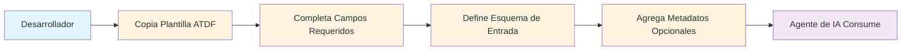
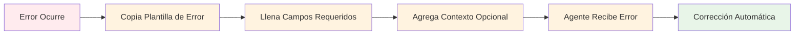

# Agent Tool Description Format (ATDF) - Especificación

## 🎯 Visión General

El **Agent Tool Description Format (ATDF)** es un estándar para describir herramientas de agentes de IA y manejar respuestas de error de manera estandarizada, **independientemente del lenguaje de programación, framework o herramienta utilizada**.

## 📋 Conceptos Fundamentales

### ¿Qué es ATDF?

ATDF es un **formato JSON estandarizado** que define **plantillas reutilizables** para:

1. **Descripción de Herramientas**: Plantillas para describir herramientas para agentes de IA
2. **Respuestas de Error Enriquecidas**: Plantillas estandarizadas para errores con contexto
3. **Metadatos de Herramientas**: Información adicional para mejor integración

### ¿Por qué ATDF?

- **Interoperabilidad**: Funciona con cualquier agente de IA compatible
- **Estandarización**: **Plantillas consistentes** independientes de la implementación
- **Contexto Enriquecido**: Errores con información detallada para corrección automática
- **Extensibilidad**: Fácil de extender para casos de uso específicos
- **Reutilización**: **Plantillas que puedes copiar y adaptar** a tu proyecto
- **No-Code Friendly**: Funciona perfectamente con herramientas visuales como N8N, Zapier, etc.

## 🔧 Especificación del Formato

### 1. Plantilla de Descripción de Herramientas

#### Estructura Básica (Plantilla Mínima)
```json
{
  "tools": [
    {
      "name": "string",
      "description": "string",
      "inputSchema": {
        "type": "object",
        "properties": {},
        "required": []
      }
    }
  ]
}
```

#### Cómo Completar la Plantilla

| Campo | Tipo | Requerido | Descripción | Ejemplo |
|-------|------|-----------|-------------|---------|
| `name` | string | ✅ | Identificador único de la herramienta | `"hotel_reservation"` |
| `description` | string | ✅ | Descripción legible de la herramienta | `"Make a hotel reservation"` |
| `inputSchema` | object | ✅ | Esquema JSON Schema para parámetros de entrada | Ver ejemplo completo |

#### Plantilla Completa con Metadatos
```json
{
  "tools": [
    {
      "name": "nombre_herramienta",
      "description": "Descripción clara de lo que hace la herramienta",
      "version": "1.0.0",
      "tags": ["categoria1", "categoria2"],
      "inputSchema": {
        "type": "object",
        "properties": {
          "parametro1": {
            "type": "string",
            "description": "Descripción del parámetro",
            "minLength": 1
          },
          "parametro2": {
            "type": "integer",
            "minimum": 1,
            "maximum": 100,
            "description": "Descripción del parámetro"
          }
        },
        "required": ["parametro1", "parametro2"]
      },
      "examples": [
        {
          "name": "Ejemplo básico",
          "input": {
            "parametro1": "valor_ejemplo",
            "parametro2": 10
          }
        }
      ]
    }
  ]
}
```

#### Campos Opcionales

| Campo | Tipo | Descripción | Ejemplo |
|-------|------|-------------|---------|
| `version` | string | Versión de la herramienta | `"1.0.0"` |
| `tags` | array | Etiquetas para categorización | `["travel", "booking"]` |
| `examples` | array | Ejemplos de uso | Ver sección de ejemplos |

#### Tipos de Datos en inputSchema

| Tipo | Descripción | Ejemplo |
|------|-------------|---------|
| `string` | Texto | `{"type": "string", "minLength": 1}` |
| `integer` | Número entero | `{"type": "integer", "minimum": 1, "maximum": 100}` |
| `number` | Número decimal | `{"type": "number", "minimum": 0.0}` |
| `boolean` | Verdadero/Falso | `{"type": "boolean"}` |
| `array` | Lista de elementos | `{"type": "array", "items": {"type": "string"}}` |
| `object` | Objeto con propiedades | `{"type": "object", "properties": {}}` |

#### Formatos Especiales

| Formato | Descripción | Ejemplo |
|---------|-------------|---------|
| `email` | Dirección de correo | `{"type": "string", "format": "email"}` |
| `date-time` | Fecha y hora | `{"type": "string", "format": "date-time"}` |
| `date` | Solo fecha | `{"type": "string", "format": "date"}` |
| `uri` | URL | `{"type": "string", "format": "uri"}` |

#### Plantilla de Ejemplo Completo
```json
{
  "tools": [
    {
      "name": "hotel_reservation",
      "description": "Make a hotel reservation with validation and ATDF error handling",
      "version": "1.0.0",
      "tags": ["travel", "booking", "hotel"],
      "inputSchema": {
        "type": "object",
        "properties": {
          "guest_name": {
            "type": "string",
            "description": "Full name of the guest",
            "minLength": 1
          },
          "email": {
            "type": "string",
            "format": "email",
            "description": "Guest email address"
          },
          "check_in": {
            "type": "string",
            "format": "date-time",
            "description": "Check-in date and time"
          },
          "check_out": {
            "type": "string",
            "format": "date-time",
            "description": "Check-out date and time"
          },
          "room_type": {
            "type": "string",
            "enum": ["single", "double", "suite"],
            "description": "Type of room"
          },
          "guests": {
            "type": "integer",
            "minimum": 1,
            "maximum": 4,
            "description": "Number of guests"
          }
        },
        "required": ["guest_name", "email", "check_in", "check_out", "room_type", "guests"]
      },
      "examples": [
        {
          "name": "Basic reservation",
          "input": {
            "guest_name": "John Doe",
            "email": "john.doe@example.com",
            "check_in": "2025-01-15T14:00:00Z",
            "check_out": "2025-01-17T12:00:00Z",
            "room_type": "double",
            "guests": 2
          }
        }
      ]
    }
  ]
}
```

### 2. Plantilla de Respuestas de Error ATDF

#### Estructura de Error (Plantilla Básica)
```json
{
  "errors": [
    {
      "type": "string",
      "title": "string",
      "detail": "string",
      "instance": "string",
      "tool_name": "string",
      "parameter_name": "string",
      "suggested_value": "string|null",
      "context": "object"
    }
  ]
}
```

#### Cómo Completar la Plantilla de Error

| Campo | Tipo | Requerido | Descripción | Ejemplo |
|-------|------|-----------|-------------|---------|
| `type` | string | ✅ | URI que identifica el tipo de error | `"https://api.example.com/errors/invalid-date"` |
| `title` | string | ✅ | Título legible del error | `"Invalid Check-in Date"` |
| `detail` | string | ✅ | Descripción detallada del problema | `"Check-in date cannot be in the past"` |
| `instance` | string | ✅ | ID único de la instancia de error | `"/api/errors/uuid-unico"` |
| `tool_name` | string | ✅ | Nombre de la herramienta que generó el error | `"hotel_reservation"` |
| `parameter_name` | string | ✅ | Parámetro específico que causó el error | `"check_in"` |
| `suggested_value` | string\|null | ❌ | Valor sugerido para corregir el error | `"2025-01-15T12:00:00Z"` |
| `context` | object | ❌ | Información adicional de contexto | `{"current_time": "2025-01-15T12:00:00Z"}` |

#### Plantilla de Error con Contexto Completo
```json
{
  "errors": [
    {
      "type": "https://api.example.com/errors/tipo-error",
      "title": "Título del Error",
      "detail": "Descripción detallada del problema",
      "instance": "/api/errors/uuid-unico",
      "tool_name": "nombre_herramienta",
      "parameter_name": "parametro_problematico",
      "suggested_value": "valor_sugerido",
      "context": {
        "informacion_adicional": "valor",
        "timestamp": "2025-01-15T12:00:00Z"
      }
    }
  ]
}
```

#### Tipos de Error Estándar (Plantillas de URI)

| Tipo | URI | Descripción | Uso |
|------|-----|-------------|-----|
| Validation Error | `https://api.example.com/errors/validation-error` | Errores de validación de entrada | Parámetros inválidos |
| Invalid Date | `https://api.example.com/errors/invalid-date` | Fechas inválidas | Fechas en el pasado |
| Invalid Route | `https://api.example.com/errors/invalid-route` | Rutas inválidas | Origen = destino |
| Business Rule | `https://api.example.com/errors/business-rule` | Reglas de negocio | Límites de capacidad |
| Authentication | `https://api.example.com/errors/authentication` | Errores de autenticación | Credenciales inválidas |
| Authorization | `https://api.example.com/errors/authorization` | Errores de autorización | Permisos insuficientes |

#### Plantilla de Ejemplo de Error ATDF
```json
{
  "errors": [
    {
      "type": "https://api.example.com/errors/invalid-date",
      "title": "Invalid Check-in Date",
      "detail": "Check-in date cannot be in the past",
      "instance": "/api/errors/e62aa61e-d844-4761-82c3-531a070fb139",
      "tool_name": "hotel_reservation",
      "parameter_name": "check_in",
      "suggested_value": "2025-01-15T12:00:17.148869",
      "context": {
        "current_time": "2025-01-15T12:00:17.148869",
        "provided_date": "2025-01-14T10:00:00Z"
      }
    }
  ]
}
```

### 3. Respuestas Completas ATDF

#### Respuesta de Éxito
```json
{
  "reservation_id": "123e4567-e89b-12d3-a456-426614174000",
  "status": "confirmed",
  "message": "Hotel reservation created successfully",
  "details": {
    "guest_name": "John Doe",
    "email": "john.doe@example.com",
    "check_in": "2025-01-15T14:00:00Z",
    "check_out": "2025-01-17T12:00:00Z",
    "room_type": "double",
    "guests": 2,
    "total_price": 299.99,
    "confirmation_number": "HTL-2025-001234",
    "cancellation_policy": "Free cancellation until 24 hours before check-in"
  }
}
```

#### Respuesta de Error (Múltiples Errores)
```json
{
  "errors": [
    {
      "type": "https://api.example.com/errors/invalid-date",
      "title": "Invalid Check-in Date",
      "detail": "Check-in date cannot be in the past",
      "instance": "/api/errors/e62aa61e-d844-4761-82c3-531a070fb139",
      "tool_name": "hotel_reservation",
      "parameter_name": "check_in",
      "suggested_value": "2025-01-15T12:00:17.148869",
      "context": {
        "current_time": "2025-01-15T12:00:17.148869",
        "provided_date": "2025-01-14T10:00:00Z"
      }
    },
    {
      "type": "https://api.example.com/errors/validation-error",
      "title": "Invalid Email Format",
      "detail": "Email address format is invalid",
      "instance": "/api/errors/f73bb62f-e955-4872-93d4-642181082240",
      "tool_name": "hotel_reservation",
      "parameter_name": "email",
      "suggested_value": "john.doe@example.com",
      "context": {
        "provided_value": "invalid-email",
        "validation_rule": "email_format"
      }
    }
  ]
}
```

#### Respuesta de Error (Regla de Negocio)
```json
{
  "errors": [
    {
      "type": "https://api.example.com/errors/business-rule",
      "title": "Room Not Available",
      "detail": "Selected room type is not available for the requested dates",
      "instance": "/api/errors/g84cc73g-f066-5983-04e5-753292193351",
      "tool_name": "hotel_reservation",
      "parameter_name": "room_type",
      "suggested_value": "single",
      "context": {
        "requested_room_type": "suite",
        "available_room_types": ["single", "double"],
        "check_in": "2025-01-15T14:00:00Z",
        "check_out": "2025-01-17T12:00:00Z"
      }
    }
  ]
}
```

#### Respuesta de Error (Autenticación)
```json
{
  "errors": [
    {
      "type": "https://api.example.com/errors/authentication",
      "title": "Authentication Required",
      "detail": "Valid authentication credentials are required to access this resource",
      "instance": "/api/errors/h95dd84h-g177-6094-15f6-864403304462",
      "tool_name": "hotel_reservation",
      "parameter_name": "authentication",
      "suggested_value": null,
      "context": {
        "required_scope": "hotel:write",
        "provided_scope": "hotel:read",
        "authentication_method": "bearer_token"
      }
    }
  ]
}
```

## 🔄 Flujo de Trabajo ATDF

### 1. Descripción de Herramientas


### 2. Manejo de Errores


## 📋 Plantillas de Uso Común

### Plantilla para Herramienta de Validación
```json
{
  "tools": [
    {
      "name": "validate_data",
      "description": "Validate input data against schema",
      "inputSchema": {
        "type": "object",
        "properties": {
          "data": {
            "type": "object",
            "description": "Data to validate"
          },
          "schema": {
            "type": "object",
            "description": "JSON Schema for validation"
          }
        },
        "required": ["data", "schema"]
      }
    }
  ]
}
```

### Plantilla para Herramienta de Búsqueda
```json
{
  "tools": [
    {
      "name": "search_database",
      "description": "Search database with filters",
      "inputSchema": {
        "type": "object",
        "properties": {
          "query": {
            "type": "string",
            "description": "Search query"
          },
          "filters": {
            "type": "object",
            "description": "Search filters"
          },
          "limit": {
            "type": "integer",
            "minimum": 1,
            "maximum": 100,
            "default": 10
          }
        },
        "required": ["query"]
      }
    }
  ]
}
```

### Plantilla para Error de Validación
```json
{
  "errors": [
    {
      "type": "https://api.example.com/errors/validation-error",
      "title": "Validation Error",
      "detail": "Parameter validation failed",
      "instance": "/api/errors/{uuid}",
      "tool_name": "tool_name",
      "parameter_name": "invalid_parameter",
      "suggested_value": "correct_value",
      "context": {
        "validation_errors": ["error1", "error2"],
        "timestamp": "2025-01-15T12:00:00Z"
      }
    }
  ]
}
```

## 🎯 Implementación

### Pasos para Implementar ATDF

1. **Copia la plantilla** de descripción de herramienta
2. **Completa los campos requeridos** (name, description, inputSchema)
3. **Define el esquema** de entrada con validaciones
4. **Agrega campos opcionales** (version, tags, examples)
5. **Implementa el manejo de errores** usando las plantillas ATDF
6. **Prueba la integración** con agentes de IA

### Verificación de Conformidad

Para verificar que tu implementación cumple con ATDF:

- ✅ Usa la estructura JSON correcta
- ✅ Incluye todos los campos requeridos
- ✅ Usa tipos de error estándar
- ✅ Proporciona contexto en errores
- ✅ Incluye valores sugeridos cuando sea posible

## 🔗 Enlaces Relacionados

- **[Ejemplos de Implementación](../docs/examples.md)** - Ejemplos en múltiples lenguajes y herramientas
- **[Guía de Implementación](./IMPLEMENTATION_GUIDE.md)** - Cómo implementar ATDF
- **[Mejores Prácticas](./BEST_PRACTICES.md)** - Recomendaciones para implementaciones robustas

---

**ATDF** - Plantillas estandarizadas para herramientas de agentes de IA 🚀 