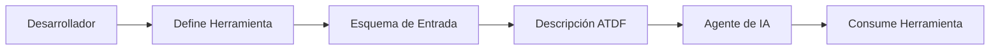
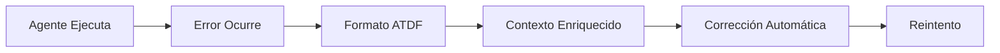

# Agent Tool Description Format (ATDF) - Especificación

## 🎯 Visión General

El **Agent Tool Description Format (ATDF)** es un estándar para describir herramientas de agentes de IA y manejar respuestas de error de manera estandarizada, independientemente del lenguaje de programación o framework utilizado.

## 📋 Conceptos Fundamentales

### ¿Qué es ATDF?

ATDF es un formato JSON estandarizado que define:

1. **Descripción de Herramientas**: Cómo describir herramientas para agentes de IA
2. **Respuestas de Error Enriquecidas**: Formato estandarizado para errores con contexto
3. **Metadatos de Herramientas**: Información adicional para mejor integración

### ¿Por qué ATDF?

- **Interoperabilidad**: Funciona con cualquier agente de IA compatible
- **Estandarización**: Formato consistente independiente de la implementación
- **Contexto Enriquecido**: Errores con información detallada para corrección automática
- **Extensibilidad**: Fácil de extender para casos de uso específicos

## 🔧 Especificación del Formato

### 1. Descripción de Herramientas

#### Estructura Básica
```json
{
  "tools": [
    {
      "name": "string",
      "description": "string",
      "inputSchema": {
        "type": "object",
        "properties": {},
        "required": []
      }
    }
  ]
}
```

#### Campos Requeridos

| Campo | Tipo | Descripción | Ejemplo |
|-------|------|-------------|---------|
| `name` | string | Identificador único de la herramienta | `"hotel_reservation"` |
| `description` | string | Descripción legible de la herramienta | `"Make a hotel reservation"` |
| `inputSchema` | object | Esquema JSON Schema para parámetros de entrada | Ver ejemplo completo |

#### Campos Opcionales

| Campo | Tipo | Descripción | Ejemplo |
|-------|------|-------------|---------|
| `version` | string | Versión de la herramienta | `"1.0.0"` |
| `tags` | array | Etiquetas para categorización | `["travel", "booking"]` |
| `examples` | array | Ejemplos de uso | Ver sección de ejemplos |

#### Ejemplo Completo
```json
{
  "tools": [
    {
      "name": "hotel_reservation",
      "description": "Make a hotel reservation with validation and ATDF error handling",
      "version": "1.0.0",
      "tags": ["travel", "booking", "hotel"],
      "inputSchema": {
        "type": "object",
        "properties": {
          "guest_name": {
            "type": "string",
            "description": "Full name of the guest",
            "minLength": 1
          },
          "email": {
            "type": "string",
            "format": "email",
            "description": "Guest email address"
          },
          "check_in": {
            "type": "string",
            "format": "date-time",
            "description": "Check-in date and time"
          },
          "check_out": {
            "type": "string",
            "format": "date-time",
            "description": "Check-out date and time"
          },
          "room_type": {
            "type": "string",
            "enum": ["single", "double", "suite"],
            "description": "Type of room"
          },
          "guests": {
            "type": "integer",
            "minimum": 1,
            "maximum": 4,
            "description": "Number of guests"
          }
        },
        "required": ["guest_name", "email", "check_in", "check_out", "room_type", "guests"]
      },
      "examples": [
        {
          "name": "Basic reservation",
          "input": {
            "guest_name": "John Doe",
            "email": "john.doe@example.com",
                    "check_in": "2025-01-15T14:00:00Z",
        "check_out": "2025-01-17T12:00:00Z",
            "room_type": "double",
            "guests": 2
          }
        }
      ]
    }
  ]
}
```

### 2. Respuestas de Error ATDF

#### Estructura de Error
```json
{
  "errors": [
    {
      "type": "string",
      "title": "string",
      "detail": "string",
      "instance": "string",
      "tool_name": "string",
      "parameter_name": "string",
      "suggested_value": "string|null",
      "context": "object"
    }
  ]
}
```

#### Campos de Error

| Campo | Tipo | Requerido | Descripción |
|-------|------|-----------|-------------|
| `type` | string | ✅ | URI que identifica el tipo de error |
| `title` | string | ✅ | Título legible del error |
| `detail` | string | ✅ | Descripción detallada del problema |
| `instance` | string | ✅ | ID único de la instancia de error |
| `tool_name` | string | ✅ | Nombre de la herramienta que generó el error |
| `parameter_name` | string | ✅ | Parámetro específico que causó el error |
| `suggested_value` | string\|null | ❌ | Valor sugerido para corregir el error |
| `context` | object | ❌ | Información adicional de contexto |

#### Tipos de Error Estándar

| Tipo | URI | Descripción | Uso |
|------|-----|-------------|-----|
| Validation Error | `https://api.example.com/errors/validation-error` | Errores de validación de entrada | Parámetros inválidos |
| Invalid Date | `https://api.example.com/errors/invalid-date` | Fechas inválidas | Fechas en el pasado |
| Invalid Route | `https://api.example.com/errors/invalid-route` | Rutas inválidas | Origen = destino |
| Business Rule | `https://api.example.com/errors/business-rule` | Reglas de negocio | Límites de capacidad |
| Authentication | `https://api.example.com/errors/authentication` | Errores de autenticación | Credenciales inválidas |
| Authorization | `https://api.example.com/errors/authorization` | Errores de autorización | Permisos insuficientes |

#### Ejemplo de Error ATDF
```json
{
  "errors": [
    {
      "type": "https://api.example.com/errors/invalid-date",
      "title": "Invalid Check-in Date",
      "detail": "Check-in date cannot be in the past",
      "instance": "/api/errors/e62aa61e-d844-4761-82c3-531a070fb139",
      "tool_name": "hotel_reservation",
      "parameter_name": "check_in",
      "suggested_value": "2025-01-15T12:00:17.148869",
      "context": {
        "current_time": "2025-01-15T12:00:17.148869",
        "provided_date": "2025-01-14T10:00:00Z"
      }
    }
  ]
}
```

## 🔄 Flujo de Trabajo ATDF

### 1. Descripción de Herramientas


### 2. Manejo de Errores


## 📚 Mejores Prácticas

### Para Descripción de Herramientas

1. **Nombres Descriptivos**: Usa nombres claros y específicos
2. **Descripciones Detalladas**: Explica qué hace la herramienta
3. **Esquemas Validados**: Usa JSON Schema para validación
4. **Ejemplos Incluidos**: Proporciona ejemplos de uso
5. **Versionado**: Incluye versiones para compatibilidad

### Para Respuestas de Error

1. **Tipos Específicos**: Usa URIs específicas para tipos de error
2. **Contexto Útil**: Incluye información para corrección
3. **Valores Sugeridos**: Proporciona valores cuando sea posible
4. **IDs Únicos**: Usa IDs únicos para seguimiento
5. **Mensajes Claros**: Títulos y detalles legibles

### Para Implementación

1. **Consistencia**: Mantén formato consistente
2. **Extensibilidad**: Diseña para futuras extensiones
3. **Validación**: Valida esquemas de entrada
4. **Logging**: Registra errores para debugging
5. **Documentación**: Documenta tipos de error personalizados

## 🔧 Extensibilidad

### Tipos de Error Personalizados

Puedes definir tipos de error específicos para tu dominio:

```json
{
  "type": "https://your-domain.com/errors/insufficient-funds",
  "title": "Insufficient Funds",
  "detail": "Account balance is insufficient for this transaction",
  "tool_name": "payment_processor",
  "parameter_name": "amount",
  "suggested_value": "50.00",
  "context": {
    "current_balance": "25.00",
    "requested_amount": "100.00"
  }
}
```

### Metadatos Adicionales

Extiende el formato con metadatos específicos:

```json
{
  "tools": [
    {
      "name": "custom_tool",
      "description": "Custom tool with extended metadata",
      "inputSchema": {...},
      "metadata": {
        "rate_limit": "100/hour",
        "requires_auth": true,
        "cost_per_call": "0.001",
        "supported_languages": ["en", "es", "fr"]
      }
    }
  ]
}
```

## 🚀 Implementación

### Endpoints Recomendados

| Endpoint | Método | Descripción |
|----------|--------|-------------|
| `/tools` | GET | Lista todas las herramientas disponibles |
| `/tools/{name}` | GET | Obtiene descripción de herramienta específica |
| `/tools/{name}/execute` | POST | Ejecuta una herramienta específica |

### Headers Recomendados

| Header | Descripción |
|--------|-------------|
| `Content-Type: application/json` | Para todas las peticiones |
| `Accept: application/json` | Para respuestas JSON |
| `X-ATDF-Version: 1.0` | Versión de ATDF utilizada |

## 📖 Referencias

- [JSON Schema Specification](https://json-schema.org/)
- [RFC 7807 - Problem Details](https://tools.ietf.org/html/rfc7807)
- [OpenAPI Specification](https://swagger.io/specification/)

---

**Versión**: 1.0.0  
**Última Actualización**: Enero 2025  
**Estado**: Estable 