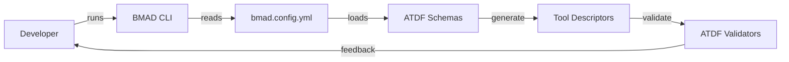

# BMAD-METHOD Integration with ATDF

> **Internal use only:** BMAD-METHOD is internal coordination tooling for the ATDF team and is not part of the ATDF protocol.

## Overview

This document describes the integration of BMAD-METHOD (Behavioral Multi-Agent Development) with the Agent Tool Description Format (ATDF) project. This integration enables AI-driven agile development workflows specifically tailored for ATDF enhancement and tool ecosystem expansion.

## What is BMAD-METHOD?

BMAD-METHOD is an AI-driven agile development framework that uses specialized agents to handle different aspects of software development:

- **Analyst Agent**: Requirements analysis and user story creation
- **PM Agent**: Project management and sprint planning
- **Architect Agent**: System design and technical architecture
- **Developer Agent**: Code implementation and technical solutions
- **QA Agent**: Testing strategies and quality assurance
- **ATDF Specialist**: Domain-specific expertise for ATDF

## Integration Benefits

### For ATDF Project
- **Agile Development**: Structured development workflows
- **Quality Assurance**: Automated testing and validation
- **Documentation**: Automatic generation of technical docs
- **Standardization**: Consistent development practices
- **Scalability**: Efficient handling of complex features

### For BMAD-METHOD
- **Standardized Tools**: ATDF provides a standard format for tool descriptions
- **Error Handling**: Robust error response modeling
- **Interoperability**: Enhanced compatibility across AI platforms
- **Real-world Testing**: Production-ready environment for validation

## Installation

### Prerequisites

- **Node.js** >= 20
- **Python** >= 3.10 (3.12 recommended)
- **pip** with virtual environment support
- **npm** latest LTS
- **Git** for source control
- *(Optional)* **BMAD CLI** (`npm install -g bmad-method`) for end-to-end automation

### Setup Steps

1. **Clone the repository**
   ```bash
   git clone https://github.com/MauricioPerera/agent-tool-description-format.git
   cd agent-tool-description-format
   ```
2. **Create a Python virtual environment**
   ```bash
   python -m venv .venv
   .venv\\Scripts\\activate    # Windows
   source .venv/bin/activate      # Linux/macOS
   ```
3. **Install ATDF dependencies**
   ```bash
   pip install -r requirements-dev.txt -r requirements.txt
   pip install -r tools/requirements.txt
   ```
4. **Install JavaScript dependencies (optional but recommended for SDK work)**
   ```bash
   cd js
   npm install
   cd ..
   ```
5. **Run the BMAD integration bootstrap**
   ```bash
   python tools/bmad_atdf_integration.py --init
   ```
   This populates BMAD configuration templates and links them to the ATDF schemas described in [Version Compatibility](en/version_compatibility.md).

6. **Validate the environment**
   ```bash
   python tools/validator.py examples/date_validator.json --schema schema/atdf_schema.json
   python tools/validate_enhanced.py examples/date_validator.json
   ```

> **Tip:** Add `.venv/` to your `.gitignore` to avoid committing local environments.## Configuration

### Integration Flow



The flow highlights how BMAD orchestration consumes the same schemas documented in [Version Compatibility](en/version_compatibility.md) before handing control back to ATDF validators.

### BMAD Configuration (`bmad.config.yml`)

### BMAD Configuration (`bmad.config.yml`)

The configuration file defines:

- **Project metadata**: Name, version, description
- **Technical preferences**: Languages, frameworks, tools
- **Agent specializations**: Domain-specific configurations
- **Workflow definitions**: Development processes
- **Integration settings**: MCP, FastAPI, vector search
- **Quality gates**: Testing and validation requirements

Key sections:

```yaml
project:
  name: "agent-tool-description-format"
  type: "open-source-library"
  domain: "ai-agent-tools"

technical_preferences:
  primary_languages: ["python", "typescript", "javascript"]
  frameworks: ["fastapi", "pydantic", "pytest"]
  architecture: "microservices"
  
agents:
  atdf_specialist:
    specialization: "ATDF Schema Design and Implementation"
    focus_areas: ["schema_design", "error_handling", "tool_integration"]
```

### Agent Definitions

#### ATDF Specialist (`bmad/agents/atdf-specialist.md`)
- **Role**: ATDF domain expert
- **Expertise**: Schema design, error handling, tool integration
- **Responsibilities**: Analysis, architecture, development, testing

#### BMAD Orchestrator (`bmad/agents/bmad-orchestrator.md`)
- **Role**: Multi-agent coordination
- **Responsibilities**: Workflow management, task distribution, quality gates
- **Integration**: Coordinates all BMAD agents for ATDF development

### Workflow Definitions

#### ATDF Enhancement (`bmad/workflows/atdf-enhancement.yml`)
- **Purpose**: Adding new features to ATDF
- **Phases**: Planning, Design, Implementation, Testing, Deployment
- **Agents**: ATDF Specialist, Architect, Developer, QA, PM

#### Tool Integration (`bmad/workflows/tool-integration.yml`)
- **Purpose**: Integrating ATDF with external frameworks
- **Target Frameworks**: FastAPI, MCP, OpenAPI, N8N, Zapier
- **Phases**: Analysis, Design, Implementation, Testing, Documentation

## Usage

### Getting Started

1. **Upload Agent Definition**:
   - Go to your preferred AI platform (ChatGPT, Gemini, Claude)
   - Upload `bmad/agents/bmad-orchestrator.md`
   - Start with: `*help` or `*status`

2. **Available Commands**:
   ```bash
   npm run bmad:update    # Update BMAD-METHOD
   npm run bmad:status    # Check BMAD status
   npm run bmad:tools     # List available tools
   npm run bmad:agents    # List configured agents
   ```

### BMAD Commands

#### Orchestrator Commands
- `*help` - Show available commands and usage
- `*status` - Display current project status
- `*agents` - List all available agents
- `*workflows` - Show available workflows
- `*start [workflow]` - Start a specific workflow
- `*assign [agent] [task]` - Assign task to specific agent

#### Agent-Specific Commands
- `*analyze` - Perform ATDF analysis
- `*design` - Create architectural designs
- `*implement` - Code implementation
- `*test` - Run testing procedures
- `*document` - Generate documentation

### Workflow Examples

#### 1. Adding a New ATDF Feature

```markdown
*start atdf-enhancement

Workflow: ATDF Enhancement
Phase: Planning & Analysis
Agent: ATDF Specialist

Task: Analyze requirements for new feature
- Review current ATDF specification
- Identify enhancement opportunities
- Create detailed requirements document
```

#### 2. Integrating with New Framework

```markdown
*start tool-integration

Workflow: Tool Integration
Phase: Analysis & Planning
Agent: Architect

Task: Design integration architecture
- Analyze target framework capabilities
- Design ATDF mapping strategy
- Create integration specifications
```

## Directory Structure

```
agent-tool-description-format/
├── bmad/                          # BMAD-METHOD files
│   ├── agents/                    # Agent definitions
│   │   ├── atdf-specialist.md     # ATDF domain expert
│   │   └── bmad-orchestrator.md   # Multi-agent coordinator
│   ├── workflows/                 # Workflow definitions
│   │   ├── atdf-enhancement.yml   # Feature enhancement workflow
│   │   └── tool-integration.yml   # Framework integration workflow
│   ├── tools/                     # Generated tool descriptions
│   └── project_brief.md           # Project overview for agents
├── tools/                         # Integration tools
│   └── bmad_atdf_integration.py   # BMAD-ATDF integration script
├── bmad.config.yml               # BMAD configuration
├── package.json                  # Node.js dependencies
├── install_bmad.bat             # Windows installation script
└── install_bmad.sh              # Linux/macOS installation script
```

## Integration Components

### 1. BMAD-ATDF Integration Script

**File**: `tools/bmad_atdf_integration.py`

**Purpose**: Bridges BMAD-METHOD with ATDF project

**Features**:
- Loads ATDF schemas and generates BMAD-compatible tool descriptions
- Creates agent-specific tools for different development roles
- Sets up BMAD directory structure and configuration
- Generates project brief for AI agents

### 2. Agent Definitions

**ATDF Specialist**: Domain expert for ATDF-specific tasks
- Schema design and validation
- Error response modeling
- Tool integration strategies
- Quality assurance for ATDF compliance

**BMAD Orchestrator**: Coordinates multi-agent workflows
- Task distribution and management
- Progress tracking and reporting
- Conflict resolution between agents
- Quality gate enforcement

### 3. Workflow Definitions

**ATDF Enhancement**: Structured process for adding new features
- Requirements analysis and planning
- Architectural design and review
- Implementation with testing
- Documentation and deployment

**Tool Integration**: Framework for integrating ATDF with external systems
- Compatibility analysis
- Integration architecture design
- Implementation and validation
- Documentation and maintenance

## Best Practices

### 1. Agent Collaboration
- Use the orchestrator for complex multi-agent tasks
- Assign specific agents to their areas of expertise
- Maintain clear communication between agents
- Document decisions and rationale

### 2. Workflow Management
- Follow defined phases and deliverables
- Implement quality gates at each stage
- Maintain traceability from requirements to implementation
- Regular progress reviews and adjustments

### 3. Quality Assurance
- Automated testing at multiple levels
- Code review and validation processes
- Documentation standards and compliance
- Performance and security considerations

### 4. Documentation
- Keep agent definitions up to date
- Document workflow customizations
- Maintain integration guides
- Regular updates to project brief

## Integration Checklist

- [ ] Select the correct ATDF schema (see [Version Compatibility](en/version_compatibility.md)).
- [ ] Map BMAD agents and workflows to the ATDF tools defined in `bmad.config.yml`.
- [ ] Run `python tools/bmad_atdf_integration.py --plan` to preview the generated tasks and assets.
- [ ] Validate descriptors with `python tools/validator.py` and `python tools/validate_enhanced.py`.
- [ ] Execute `python tests/run_all_tests.py` and, if the JS SDK is touched, `npm test` inside `js/`.
- [ ] Update multilingual documentation (`docs/en|es|pt`) before opening a pull request.

## Troubleshooting

### Common Issues

#### 1. Installation Problems
- **Node.js not found**: Install Node.js 20.0.0 or higher
- **Python not found**: Install Python 3.8.0 or higher
- **Permission errors**: Run with appropriate permissions
- **Network issues**: Check firewall and proxy settings

#### 2. Configuration Issues
- **Invalid YAML**: Validate `bmad.config.yml` syntax
- **Missing files**: Ensure all required files are present
- **Path problems**: Use absolute paths in configuration

#### 3. Agent Communication
- **Upload failures**: Check file size and format
- **Command errors**: Verify command syntax
- **Response issues**: Check agent context and memory

### Getting Help

1. **Documentation**: Check this guide and ATDF specification
2. **Issues**: Report problems on GitHub repository
3. **Community**: Join BMAD-METHOD and ATDF communities
4. **Support**: Contact maintainers for complex issues

## Advanced Usage

### Custom Agent Creation

Create specialized agents for specific ATDF use cases:

```markdown
# Custom Agent Template
## Agent: [Name]
### Role: [Specific role in ATDF ecosystem]
### Expertise: [Domain knowledge areas]
### Tools: [Available tools and commands]
### Workflows: [Supported workflow types]
```

### Workflow Customization

Modify existing workflows or create new ones:

```yaml
# Custom Workflow Template
name: "custom-atdf-workflow"
description: "Custom workflow for specific ATDF tasks"
phases:
  - name: "phase1"
    agents: ["agent1", "agent2"]
    tasks: ["task1", "task2"]
    deliverables: ["deliverable1"]
```

### Integration Extensions

Extend BMAD-ATDF integration for new frameworks:

```python
# Extension Template
class CustomFrameworkIntegration(BMadATDFIntegration):
    def generate_custom_tools(self):
        # Custom tool generation logic
        pass
    
    def setup_custom_workflows(self):
        # Custom workflow setup
        pass
```

## Roadmap

### Phase 1: Foundation (Completed)
- ✅ Basic BMAD-METHOD integration
- ✅ Core agent definitions
- ✅ Essential workflows
- ✅ Installation automation

### Phase 2: Enhancement (In Progress)
- 🔄 Advanced agent capabilities
- 🔄 Workflow optimization
- 🔄 Integration testing
- 🔄 Documentation improvements

### Phase 3: Expansion (Planned)
- 📋 Additional framework integrations
- 📋 Custom agent templates
- 📋 Workflow marketplace
- 📋 Community contributions

### Phase 4: Optimization (Future)
- 📋 Performance improvements
- 📋 Advanced analytics
- 📋 Machine learning integration
- 📋 Enterprise features

## Contributing

### How to Contribute

1. **Fork the repository**
2. **Create feature branch**: `git checkout -b feature/bmad-enhancement`
3. **Make changes**: Follow coding standards and best practices
4. **Test thoroughly**: Ensure all tests pass
5. **Submit pull request**: Include detailed description

### Contribution Areas

- **Agent Definitions**: New specialized agents
- **Workflow Templates**: Reusable development processes
- **Integration Tools**: Framework-specific integrations
- **Documentation**: Guides, tutorials, examples
- **Testing**: Test cases and validation scripts

### Guidelines

- Follow existing code style and conventions
- Include comprehensive tests for new features
- Update documentation for any changes
- Ensure backward compatibility
- Provide clear commit messages

## License

This integration follows the same license as the ATDF project. See LICENSE file for details.

## Acknowledgments

- **BMAD-METHOD**: For the innovative multi-agent development framework
- **ATDF Community**: For the standardized tool description format
- **Contributors**: All developers who helped with this integration
- **AI Platforms**: ChatGPT, Gemini, Claude for agent hosting capabilities

---

For more information about ATDF, see [ATDF_SPECIFICATION.md](ATDF_SPECIFICATION.md)

For BMAD-METHOD documentation, visit [BMAD-METHOD GitHub](https://github.com/bmad-code-org/BMAD-METHOD)