# Conceptos Fundamentales de ATDF

## 🎯 ¿Qué es ATDF?

El **Agent Tool Description Format (ATDF)** es un estándar para describir herramientas de agentes de IA y manejar respuestas de error de manera estandarizada. ATDF proporciona un formato JSON consistente que funciona independientemente del lenguaje de programación o framework utilizado.

## 🌟 Conceptos Clave

### 1. **Herramienta (Tool)**
Una **herramienta** es una función o servicio que un agente de IA puede ejecutar. Cada herramienta tiene:
- Un nombre único
- Una descripción clara
- Un esquema de entrada que define los parámetros requeridos
- Lógica de negocio para procesar la entrada

**Ejemplo:**
```json
{
  "name": "hotel_reservation",
  "description": "Make a hotel reservation with validation",
  "inputSchema": {
    "type": "object",
    "properties": {
      "guest_name": {"type": "string"},
      "email": {"type": "string", "format": "email"},
      "check_in": {"type": "string", "format": "date-time"}
    }
  }
}
```

### 2. **Esquema de Entrada (Input Schema)**
El **esquema de entrada** define la estructura y validación de los datos que una herramienta acepta. Utiliza JSON Schema para:
- Definir tipos de datos
- Establecer restricciones (longitud, rangos, patrones)
- Especificar campos requeridos
- Proporcionar descripciones y ejemplos

**Ejemplo:**
```json
{
  "type": "object",
  "properties": {
    "guest_name": {
      "type": "string",
      "description": "Full name of the guest",
      "minLength": 1,
      "maxLength": 100
    },
    "email": {
      "type": "string",
      "format": "email",
      "description": "Guest email address"
    },
    "guests": {
      "type": "integer",
      "minimum": 1,
      "maximum": 4,
      "description": "Number of guests"
    }
  },
  "required": ["guest_name", "email", "guests"]
}
```

### 3. **Respuesta de Error ATDF**
Una **respuesta de error ATDF** es un formato estandarizado para comunicar errores con contexto enriquecido. Incluye:
- Tipo de error específico
- Título y descripción claros
- Identificador único de la instancia
- Nombre de la herramienta y parámetro
- Valor sugerido para corrección
- Contexto adicional

**Ejemplo:**
```json
{
  "errors": [
    {
      "type": "https://api.example.com/errors/invalid-date",
      "title": "Invalid Check-in Date",
      "detail": "Check-in date cannot be in the past",
      "instance": "/api/errors/e62aa61e-d844-4761-82c3-531a070fb139",
      "tool_name": "hotel_reservation",
      "parameter_name": "check_in",
      "suggested_value": "2025-01-15T12:00:17.148869",
      "context": {
        "current_time": "2025-01-15T12:00:17.148869",
        "provided_date": "2025-01-14T10:00:00Z"
      }
    }
  ]
}
```

### 4. **Tipo de Error (Error Type)**
El **tipo de error** es una URI que identifica categóricamente el tipo de problema. Los tipos estándar incluyen:
- `validation-error`: Errores de validación de entrada
- `invalid-date`: Fechas inválidas
- `business-rule`: Violaciones de reglas de negocio
- `authentication`: Errores de autenticación
- `authorization`: Errores de autorización

### 5. **Contexto (Context)**
El **contexto** proporciona información adicional que ayuda a entender y resolver el error. Puede incluir:
- Valores actuales vs. esperados
- Restricciones aplicables
- Alternativas disponibles
- Información de debugging

## 🔄 Flujo de Trabajo ATDF

### 1. **Descubrimiento de Herramientas**

```mermaid
flowchart LR
    A[Agente de IA] --> B[GET /tools]
    B --> C[Descripción de Herramientas]
    C --> D[Esquemas de Entrada]
    
    style A fill:#e3f2fd
    style B fill:#fff3e0
    style C fill:#e8f5e8
    style D fill:#f3e5f5
```


**Proceso:**
1. El agente consulta el endpoint `/tools`
2. Recibe la lista de herramientas disponibles
3. Analiza los esquemas de entrada
4. Determina qué herramientas puede usar

### 2. **Ejecución de Herramientas**

```mermaid
flowchart LR
    A[Agente] --> B[POST /api/tool/execute]
    B --> C[Validación de Entrada]
    C --> D[Lógica de Negocio]
    D --> E[Respuesta]
    
    style A fill:#e3f2fd
    style B fill:#fff3e0
    style C fill:#e8f5e8
    style D fill:#fff3e0
    style E fill:#f3e5f5
```


**Proceso:**
1. El agente envía datos al endpoint de la herramienta
2. Se valida la entrada contra el esquema
3. Se ejecuta la lógica de negocio
4. Se devuelve el resultado o error

### 3. **Manejo de Errores**

```mermaid
flowchart LR
    A[Error Ocurre] --> B[Formato ATDF]
    B --> C[Contexto Enriquecido]
    C --> D[Corrección Automática]
    D --> E[Reintento]
    
    style A fill:#ffebee
    style B fill:#fff3e0
    style C fill:#e8f5e8
    style D fill:#e3f2fd
    style E fill:#f3e5f5
```


## 🎯 Beneficios de ATDF

### Para Agentes de IA
- **Descripción Clara**: Entienden exactamente qué hace cada herramienta
- **Validación Automática**: Los errores se detectan antes de la ejecución
- **Corrección Automática**: Pueden corregir errores usando valores sugeridos
- **Interoperabilidad**: Funcionan con cualquier implementación ATDF

### Para Desarrolladores
- **Estandarización**: Formato consistente independiente del lenguaje
- **Documentación Automática**: Los esquemas sirven como documentación
- **Testing Simplificado**: Validación automática de entrada
- **Debugging Mejorado**: Errores con contexto detallado

### Para Sistemas
- **Escalabilidad**: Fácil agregar nuevas herramientas
- **Mantenibilidad**: Código más limpio y organizado
- **Monitoreo**: Métricas estandarizadas
- **Integración**: Compatible con sistemas existentes

## 🔧 Componentes de una Implementación ATDF

### 1. **Tool Registry**
```python
class ToolRegistry:
    def __init__(self):
        self.tools = {}
    
    def register_tool(self, name: str, description: str, schema: dict):
        self.tools[name] = {
            "name": name,
            "description": description,
            "inputSchema": schema
        }
    
    def get_tools(self):
        return list(self.tools.values())
```

### 2. **Error Handler**
```python
class ATDFErrorHandler:
    def create_error(self, type_uri: str, title: str, detail: str,
                    tool_name: str, parameter_name: str,
                    suggested_value: str = None, context: dict = None):
        return {
            "errors": [{
                "type": type_uri,
                "title": title,
                "detail": detail,
                "instance": f"/api/errors/{uuid.uuid4()}",
                "tool_name": tool_name,
                "parameter_name": parameter_name,
                "suggested_value": suggested_value,
                "context": context or {}
            }]
        }
```

### 3. **Validator**
```python
class ATDFValidator:
    def validate_request(self, tool_name: str, data: dict):
        # Validar esquema JSON
        # Validar reglas de negocio
        # Retornar errores ATDF si es necesario
        pass
```

## 📊 Tipos de Herramientas Comunes

### 1. **Herramientas de Información**
- Búsqueda web
- Consulta de base de datos
- Análisis de datos
- Generación de reportes

### 2. **Herramientas de Acción**
- Crear/actualizar/eliminar registros
- Enviar emails
- Procesar pagos
- Programar tareas

### 3. **Herramientas de Validación**
- Verificar datos
- Validar documentos
- Comprobar permisos
- Analizar contenido

### 4. **Herramientas de Transformación**
- Convertir formatos
- Procesar imágenes
- Traducir texto
- Generar código

## 🎨 Patrones de Diseño ATDF

### 1. **Factory Pattern**
```python
class ToolFactory:
    @staticmethod
    def create_tool(tool_type: str, config: dict):
        if tool_type == "hotel_reservation":
            return HotelReservationTool(config)
        elif tool_type == "flight_booking":
            return FlightBookingTool(config)
        # ...
```

### 2. **Strategy Pattern**
```python
class ValidationStrategy:
    def validate(self, data: dict) -> list[ATDFError]:
        pass

class DateValidationStrategy(ValidationStrategy):
    def validate(self, data: dict) -> list[ATDFError]:
        # Validar fechas
        pass

class EmailValidationStrategy(ValidationStrategy):
    def validate(self, data: dict) -> list[ATDFError]:
        # Validar emails
        pass
```

### 3. **Observer Pattern**
```python
class ToolExecutionObserver:
    def on_tool_executed(self, tool_name: str, result: dict):
        # Logging, métricas, etc.
        pass

class ATDFLogger(ToolExecutionObserver):
    def on_tool_executed(self, tool_name: str, result: dict):
        logger.info(f"Tool {tool_name} executed successfully")
```

## 🔄 Ciclo de Vida de una Herramienta ATDF

### 1. **Diseño**
- Definir propósito y funcionalidad
- Identificar parámetros de entrada
- Establecer reglas de validación
- Planificar manejo de errores

### 2. **Implementación**
- Crear esquema de entrada
- Implementar lógica de negocio
- Agregar manejo de errores ATDF
- Escribir tests

### 3. **Registro**
- Registrar en el Tool Registry
- Configurar endpoints
- Agregar documentación
- Configurar monitoreo

### 4. **Uso**
- Los agentes descubren la herramienta
- Ejecutan con diferentes parámetros
- Reciben respuestas o errores ATDF
- Corrigen automáticamente si es necesario

### 5. **Mantenimiento**
- Monitorear uso y errores
- Actualizar documentación
- Mejorar validaciones
- Agregar nuevas funcionalidades

## 📚 Próximos Pasos

1. **Leer la [Especificación ATDF](./ATDF_SPECIFICATION.md)** para entender todos los detalles
2. **Revisar la [Guía de Implementación](./IMPLEMENTATION_GUIDE.md)** para comenzar a implementar
3. **Explorar los [Ejemplos](./EXAMPLES.md)** para ver implementaciones reales
4. **Consultar las [Mejores Prácticas](./BEST_PRACTICES.md)** para recomendaciones

---

**¿Listo para comenzar?** Ve a la [Guía de Implementación](./IMPLEMENTATION_GUIDE.md) para crear tu primera herramienta ATDF.

**Documentación**: [https://mauricioperera.github.io/agent-tool-description-format/](https://mauricioperera.github.io/agent-tool-description-format/) 