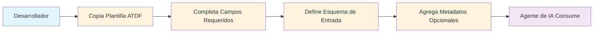
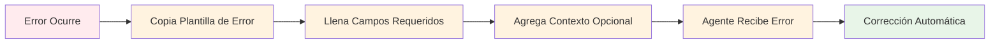
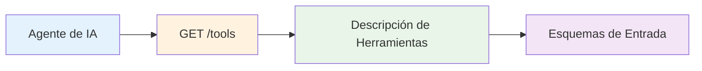
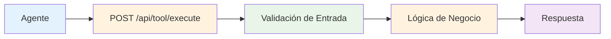
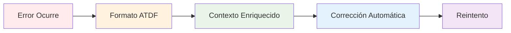
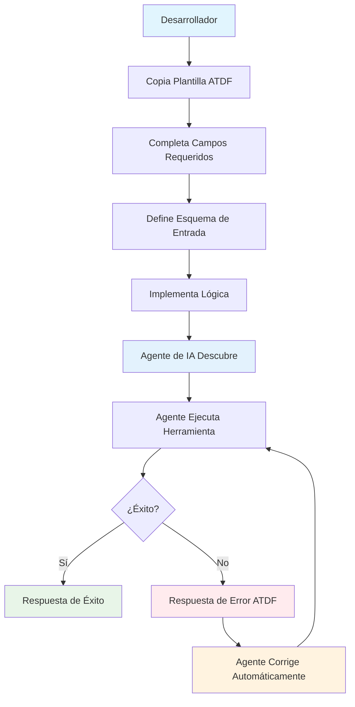
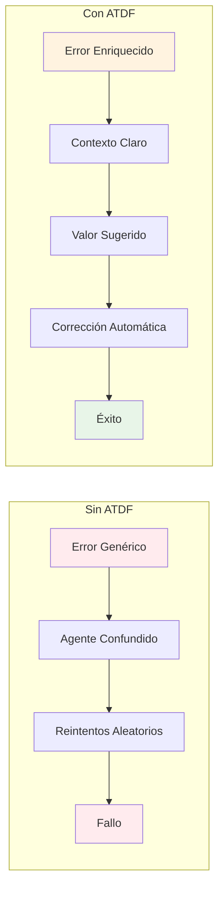
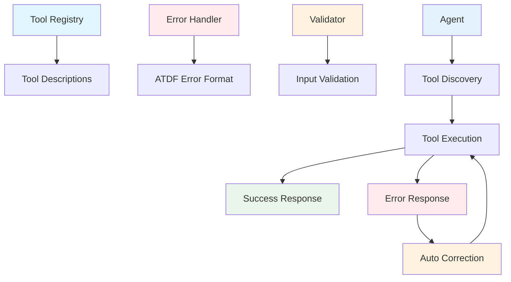
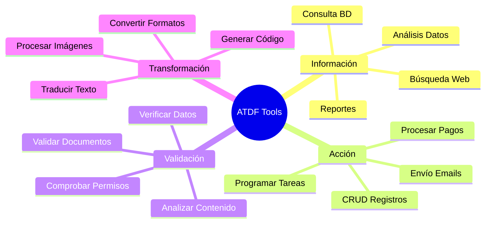
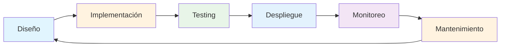

# 📊 Diagramas Mermaid ATDF

Este archivo contiene todos los diagramas Mermaid utilizados en la documentación ATDF, optimizados para máxima legibilidad y compilación correcta.

## 🔄 Flujo de Trabajo ATDF

### 1. Descripción de Herramientas

### 2. Manejo de Errores

## 🔍 Proceso de Descubrimiento

### Descubrimiento de Herramientas

### Ejecución de Herramientas

### Manejo de Errores

## 🚀 Flujo Completo de Trabajo

### Proceso End-to-End

## ⚖️ Comparación: Sin ATDF vs Con ATDF

### Flujo de Errores

## 🏗️ Arquitectura ATDF

### Componentes del Sistema

## 🎯 Tipos de Herramientas

### Categorías de Herramientas

## 🔄 Ciclo de Vida de Herramienta

### Fases de Desarrollo

## 🎨 Paleta de Colores

Los diagramas utilizan una paleta de colores consistente:

- **Azul Claro** (`#e1f5fe`): Inicio/Desarrollador
- **Azul Medio** (`#e3f2fd`): Agente de IA
- **Naranja** (`#fff3e0`): Procesos/Validación
- **Verde** (`#e8f5e8`): Éxito/Validación
- **Rojo Claro** (`#ffebee`): Errores
- **Púrpura** (`#f3e5f5`): Resultados/Metadatos

## 📝 Notas de Implementación

### Sintaxis Mermaid Utilizada

1. **flowchart**: Para diagramas de flujo
2. **mindmap**: Para mapas mentales
3. **style**: Para colorear nodos
4. **subgraph**: Para agrupar elementos
5. **flowchart TD**: Para flujos top-down
6. **flowchart LR**: Para flujos left-right

### Mejores Prácticas

- ✅ Usar `flowchart` en lugar de `graph` (más moderno)
- ✅ Agregar estilos de color para mejor legibilidad
- ✅ Usar subgraphs para agrupar conceptos relacionados
- ✅ Mantener diagramas simples y enfocados
- ✅ Usar colores consistentes en toda la documentación

---

**Nota**: Estos diagramas están optimizados para renderizarse correctamente en GitHub, GitLab, y otras plataformas que soporten Mermaid. 