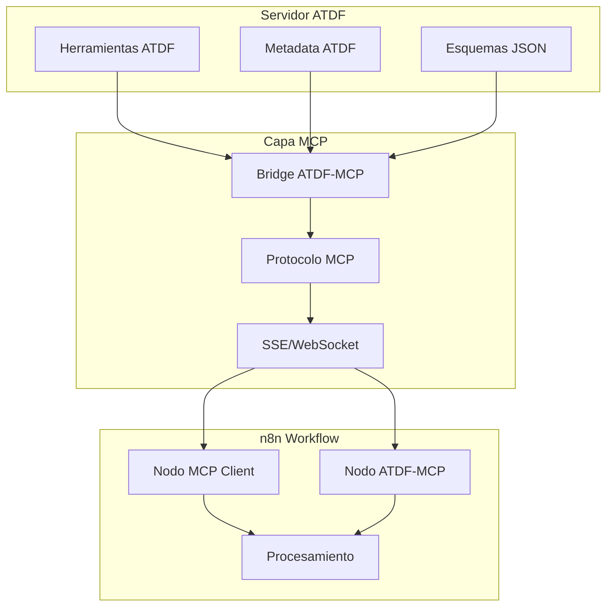

# Flujo de Integración ATDF + MCP + n8n

## Arquitectura de Integración



## Escenarios de Uso

### 1. **Uso con Nodos MCP Nativos de n8n**

```json
{
  "nodes": [
    {
      "parameters": {
        "serverUrl": "http://localhost:8001/sse",
        "operation": "listTools"
      },
      "type": "n8n-nodes-base.mcpClient",
      "name": "Listar Herramientas ATDF"
    },
    {
      "parameters": {
        "serverUrl": "http://localhost:8001/sse",
        "operation": "callTool",
        "toolName": "calculate_metrics",
        "arguments": {
          "data": "={{ $json.data }}"
        }
      },
      "type": "n8n-nodes-base.mcpClient",
      "name": "Ejecutar Herramienta ATDF"
    }
  ]
}
```

### 2. **Uso con Nodos ATDF-MCP Personalizados**

```json
{
  "nodes": [
    {
      "parameters": {
        "operation": "listTools",
        "language": "es",
        "includeMetadata": true
      },
      "type": "n8n-nodes-atdf-mcp.atdfMcpClient",
      "name": "Cliente ATDF Directo"
    },
    {
      "parameters": {
        "operation": "executeTool",
        "toolName": "process_data",
        "parameters": {
          "input": "={{ $json.input }}",
          "format": "json"
        },
        "language": "es"
      },
      "type": "n8n-nodes-atdf-mcp.atdfMcpClient",
      "name": "Ejecutar con Localización"
    }
  ]
}
```

## Ventajas de la Integración

### **Con Nodos MCP Nativos:**
- ✅ Compatibilidad inmediata
- ✅ Sin instalación adicional
- ✅ Estándar MCP puro

### **Con Nodos ATDF-MCP Personalizados:**
- ✅ Soporte nativo para metadatos ATDF
- ✅ Localización automática
- ✅ Validación de esquemas
- ✅ UI optimizada para ATDF

## Flujo de Datos

```
1. Servidor ATDF expone herramientas
   ↓
2. Bridge convierte ATDF → MCP
   ↓
3. n8n se conecta vía MCP
   ↓
4. Ejecuta herramientas con metadatos ATDF
   ↓
5. Recibe respuestas localizadas
```

## Configuración Recomendada

### Para Proyectos Nuevos:
- Usar nodos ATDF-MCP personalizados
- Aprovechar todas las características ATDF

### Para Proyectos Existentes:
- Usar nodos MCP nativos + Bridge
- Migración gradual sin cambios disruptivos