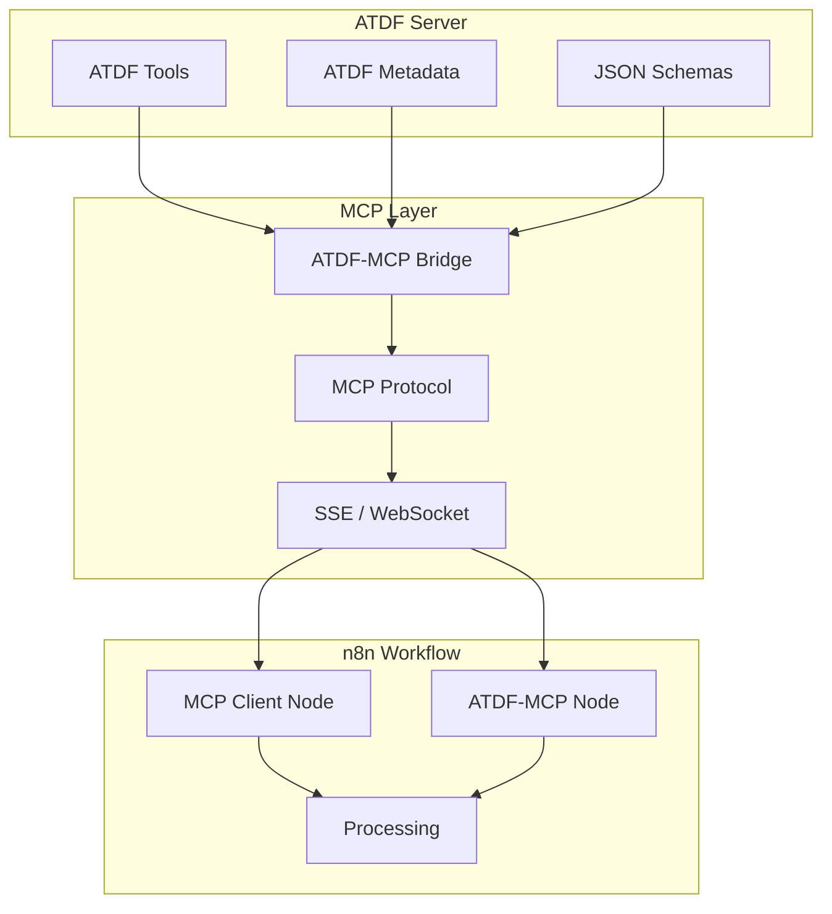

## Integration Architecture



## Usage Scenarios

### 1. Using n8n native MCP nodes

```json
{
  "nodes": [
    {
      "parameters": {
        "serverUrl": "http://localhost:8001/sse",
        "operation": "listTools"
      },
      "type": "n8n-nodes-base.mcpClient",
      "name": "List ATDF Tools"
    },
    {
      "parameters": {
        "serverUrl": "http://localhost:8001/sse",
        "operation": "callTool",
        "toolName": "calculate_metrics",
        "arguments": {
          "data": "={{ $json.data }}"
        }
      },
      "type": "n8n-nodes-base.mcpClient",
      "name": "Execute ATDF Tool"
    }
  ]
}
```

**When to use it:** quick experiments or proof of concept without installing custom nodes.

### 2. Using custom ATDF-MCP nodes

```json
{
  "nodes": [
    {
      "parameters": {
        "operation": "listTools",
        "language": "en",
        "includeMetadata": true
      },
      "type": "n8n-nodes-atdf-mcp.atdfMcpClient",
      "name": "Direct ATDF Client"
    },
    {
      "parameters": {
        "operation": "executeTool",
        "toolName": "process_data",
        "parameters": {
          "input": "={{ $json.input }}",
          "format": "json"
        },
        "language": "en"
      },
      "type": "n8n-nodes-atdf-mcp.atdfMcpClient",
        "name": "Execute with Localization"
    }
  ]
}
```

**When to use it:** you need full ATDF context (metadata, localization, prerequisites) inside n8n.

## Approach Comparison

| Approach | Benefits |
|----------|----------|
| Native MCP nodes | ? Zero extra installation � ? Pure MCP interoperability � ? Great for demos |
| Custom ATDF-MCP nodes | ? Full ATDF metadata � ? Automatic localization � ? Built-in validation � ? UI tailored for ATDF |

## Data Flow

```
1. The ATDF server exposes tools and metadata
2. The bridge translates ATDF ? MCP
3. n8n connects over MCP via SSE/WebSocket
4. Nodes execute tools with ATDF parameters
5. Enriched responses return to n8n for processing
```

## Recommended Setup

### New projects
- Install the `n8n-nodes-atdf-mcp` package
- Configure the bridge with your ATDF endpoint
- Enable localization when collaborating with multilingual teams

```bash
# Quick local bridge
python examples/fastapi_mcp_integration.py
python examples/mcp_atdf_bridge.py --port 8001 --atdf-server http://localhost:8000
```

### Existing projects
- Keep the native MCP nodes and add the ATDF-MCP bridge
- Validate descriptors with `tools/validator.py` before exposing them
- Plan a gradual migration to the dedicated nodes

## Related Resources
- [n8n MCP guide](n8n_mcp_server_guide.md)
- [ATDF version compatibility](version_compatibility.md)
- Sample flow: `examples/n8n_mcp_comparison_workflow.json`

