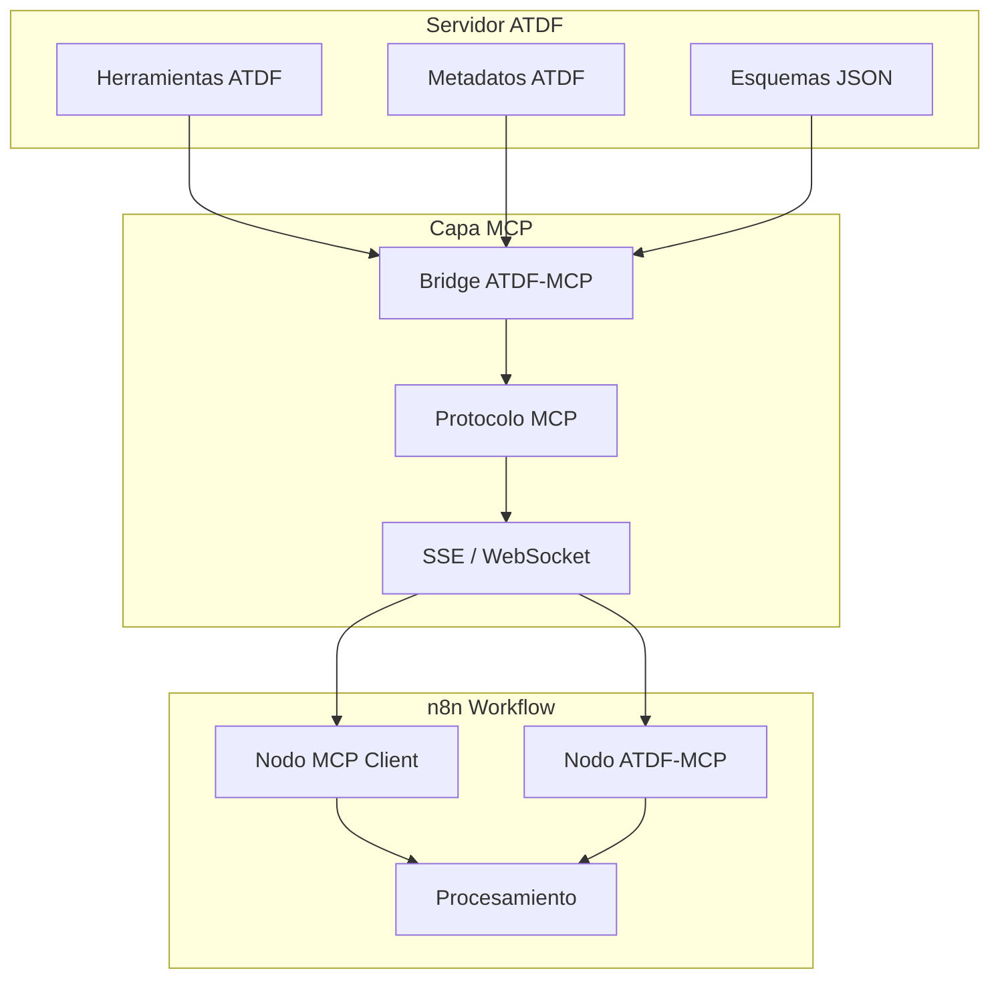

# Flujo de Integración ATDF + MCP + n8n

## Arquitectura de Integración



## Escenarios de Uso

### 1. Uso con nodos MCP nativos de n8n

```json
{
  "nodes": [
    {
      "parameters": {
        "serverUrl": "http://localhost:8001/sse",
        "operation": "listTools"
      },
      "type": "n8n-nodes-base.mcpClient",
      "name": "Listar Herramientas ATDF"
    },
    {
      "parameters": {
        "serverUrl": "http://localhost:8001/sse",
        "operation": "callTool",
        "toolName": "calculate_metrics",
        "arguments": {
          "data": "={{ $json.data }}"
        }
      },
      "type": "n8n-nodes-base.mcpClient",
      "name": "Ejecutar Herramienta ATDF"
    }
  ]
}
```

**Cuándo usarlo:** quieres probar rápidamente el bridge ATDF-MCP sin instalar nodos adicionales.

### 2. Uso con nodos ATDF-MCP personalizados

```json
{
  "nodes": [
    {
      "parameters": {
        "operation": "listTools",
        "language": "es",
        "includeMetadata": true
      },
      "type": "n8n-nodes-atdf-mcp.atdfMcpClient",
      "name": "Cliente ATDF Directo"
    },
    {
      "parameters": {
        "operation": "executeTool",
        "toolName": "process_data",
        "parameters": {
          "input": "={{ $json.input }}",
          "format": "json"
        },
        "language": "es"
      },
      "type": "n8n-nodes-atdf-mcp.atdfMcpClient",
        "name": "Ejecutar con Localización"
    }
  ]
}
```

**Cuándo usarlo:** necesitas metadatos completos de ATDF (localización, prerequisitos, feedback) dentro de n8n.

## Ventajas de cada enfoque

| Enfoque | Beneficios |
|---------|------------|
| Nodos MCP nativos | ✅ Sin instalación extra · ✅ Interoperabilidad MCP pura · ✅ Ideal para demos rápidas |
| Nodos ATDF-MCP personalizados | ✅ Metadatos ATDF completos · ✅ Localización automática · ✅ Validación integrada · ✅ UI pensada para ATDF |

## Flujo de Datos

```
1. El servidor ATDF expone herramientas y metadatos
2. El bridge traduce ATDF → MCP
3. n8n consume MCP vía SSE/WebSocket
4. Los nodos ejecutan herramientas con parámetros ATDF
5. La respuesta enriquecida vuelve a n8n y se procesa
```

## Configuración Recomendada

### Proyectos nuevos
- Instala los nodos `n8n-nodes-atdf-mcp`
- Configura el bridge con el endpoint del servidor ATDF
- Habilita localización si tu equipo usa varios idiomas

```bash
# Puente local rápido
python examples/fastapi_mcp_integration.py
python examples/mcp_atdf_bridge.py --port 8001 --atdf-server http://localhost:8000
```

### Proyectos existentes
- Mantén los nodos MCP nativos y agrega el bridge ATDF-MCP
- Valida las herramientas con `tools/validator.py` antes de exponerlas
- Planifica una migración gradual a los nodos dedicados

## Recursos Relacionados
- [Guía MCP para n8n](n8n_mcp_server_guide.md)
- [Compatibilidad de versiones ATDF](../en/version_compatibility.md)
- Ejemplo de flujo: `examples/n8n_mcp_comparison_workflow.json`
