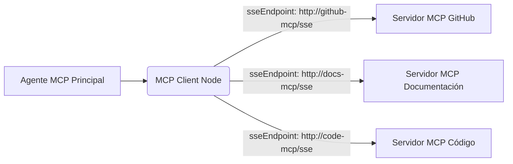

# Guía del Servidor MCP de n8n

## Introducción y objetivos

Esta guía describe las mejores prácticas y la arquitectura para construir y mantener Servidores de Procesos Comunes (MCP) utilizando n8n. El objetivo es promover la modularidad, la reutilización y la mantenibilidad de los flujos de trabajo.

## Conceptos básicos

### MCP Server Trigger
El **MCP Server Trigger** es un nodo especializado en n8n que actúa como punto de entrada para las solicitudes al servidor MCP. Permite definir la interfaz de entrada y salida del servidor.

### Subworkflows
Los **Subworkflows** son flujos de trabajo de n8n que se pueden llamar desde otros flujos de trabajo. Son fundamentales para la modularidad en la arquitectura MCP, permitiendo encapsular lógica específica en unidades reutilizables.

## Buenas prácticas MCP

### Arquitectura
*   Diseñar una arquitectura modular utilizando subworkflows para cada herramienta o proceso discreto.
*   Centralizar la lógica común en subworkflows compartidos.

### Naming (Convenciones de Nombres)
*   Utilizar nombres claros y consistentes para workflows, subworkflows, nodos y variables.
*   Prefijar los subworkflows con `SWF_` para identificarlos fácilmente.
*   Prefijar las variables de entorno con `ENV_`.
*   Utilizar snake_case para nombres de variables y parámetros.
*   Para nombres de herramientas, seguir el formato: `tool.<acción>_<entidad>` (ej. `tool.get_user`, `tool.create_invoice`).

### Salida estándar
*   Definir un formato de salida estándar para todos los subworkflows, tanto para respuestas exitosas como para errores. Esto facilita la integración y el manejo de errores. El campo `status` debe ser estrictamente `"success"` o `"error"`.

### Validación
*   Validar las entradas en cada subworkflow para asegurar la integridad de los datos.
*   Proporcionar mensajes de error claros y uniformes siguiendo el formato de error estándar.

### Seguridad
*   Proteger los endpoints del MCP Server Trigger utilizando mecanismos de autenticación y autorización.
*   Gestionar las credenciales de forma segura utilizando el gestor de credenciales de n8n.
*   Evitar exponer información sensible en los logs.

### Documentación
*   Documentar cada subworkflow, incluyendo su propósito, parámetros de entrada, formato de salida y cualquier dependencia. Se recomienda incluir un bloque ATDF en la descripción del nodo que representa la herramienta.
*   Mantener actualizada la documentación de la arquitectura general del MCP.

### Versionado
*   Versionar los subworkflows y el servidor MCP para gestionar los cambios y evitar romper integraciones existentes.
*   Utilizar un sistema de control de versiones como Git para el versionado de los workflows exportados.

## Arquitectura General

### Estructura Básica
La arquitectura MCP se basa en un flujo principal (el servidor MCP) que orquesta la ejecución de subworkflows. Cada subworkflow representa una herramienta o un proceso específico.

```
[Trigger HTTP / MCP Server Trigger] ---> [Validación Inicial] ---> [Router Lógico (Switch Node)] --+--> [Execute Workflow: SWF_Herramienta_A] ---> [Respuesta]
                                                                                                 |
                                                                                                 +--> [Execute Workflow: SWF_Herramienta_B] ---> [Respuesta]
                                                                                                 |
                                                                                                 +--> [Execute Workflow: SWF_Herramienta_C] ---> [Respuesta]
```

### Ventajas del Uso de Subworkflows
*   **Modularidad:** Descomponer problemas complejos en partes más pequeñas y manejables.
*   **Reutilización:** Utilizar la misma lógica en diferentes partes del sistema o en diferentes servidores MCP.
*   **Mantenibilidad:** Facilitar la actualización y corrección de errores al aislar la lógica en unidades independientes.
*   **Testabilidad:** Probar cada subworkflow de forma aislada.

## Diseño de Herramientas MCP

### Formato Estándar de Salida

#### Éxito
Un formato JSON estándar para respuestas exitosas ayuda a los clientes a procesar la información de manera consistente. El campo `status` siempre será `"success"`.

```json
{
  "status": "success",
  "data": {
    "resultado_especifico": "valor",
    "otro_dato": 123
  },
  "meta": {
    "timestamp": "2023-10-27T10:30:00Z"
  }
}
```

#### Error
Un formato JSON estándar para errores permite un manejo de errores centralizado y predecible. El campo `status` siempre será `"error"`.

```json
{
  "status": "error",
  "data": {
    "code": "CODIGO_ERROR_UNICO",
    "message": "Descripción legible del error.",
    "details": {
      "field": "nombre_del_campo_con_error",
      "expected": "tipo_o_formato_esperado",
      "solution": "Cómo solucionar el problema o qué se espera."
    }
  },
  "meta": {
    "timestamp": "2023-10-27T10:35:00Z"
  }
}
```

### Validación de Entradas y Errores Uniformes
*   Utilizar nodos `IF` o `Switch` al inicio de los subworkflows para validar los parámetros de entrada.
*   Si la validación falla, se debe construir una respuesta de error utilizando la estructura definida anteriormente. Por ejemplo, si un campo `user_id` es requerido pero no se provee:

```json
{
  "status": "error",
  "data": {
    "code": "VALIDATION_ERROR",
    "message": "Parámetros de entrada inválidos.",
    "details": {
      "field": "user_id",
      "expected": "string, non-empty",
      "solution": "Proveer un user_id válido."
    }
  },
  "meta": {
    "timestamp": "2023-10-27T10:40:00Z"
  }
}
```
*   Utilizar códigos de error únicos y descriptivos para facilitar la depuración y el monitoreo.

## Plantilla Base Visual para Subworkflows

Una plantilla visual estándar para subworkflows en n8n ayuda a mantener la consistencia y facilita la comprensión.

*   **Start:** Cada subworkflow comienza con un nodo `Start`.
*   **IF (Validación de Entradas):** Un nodo `IF` (o varios) para verificar que todos los parámetros de entrada necesarios están presentes y son válidos.
    *   Si la validación falla, una rama lleva a un nodo `Set` para construir el JSON de error estándar y luego al final del subworkflow (que devuelve el error al flujo padre).
*   **Acción Principal:** La secuencia de nodos que implementan la funcionalidad principal del subworkflow (ej. `HTTP Request` para llamar a una API externa, `Function` para lógica personalizada, otros nodos de n8n).
*   **IF (Verifica Éxito/Error de la Acción Principal):** Después de la acción principal, un nodo `IF` evalúa si la operación fue exitosa (ej. código de estado HTTP 2xx, ausencia de errores en un nodo `Function`).
    *   **Rama TRUE (Éxito):** Conduce a un nodo `Set` que prepara el JSON de respuesta exitosa estándar (`{ "status": "success", "data": { ... }, "meta": { ... } }`).
    *   **Rama FALSE (Error):** Conduce a un nodo `Set` que prepara el JSON de respuesta de error estándar (`{ "status": "error", "data": { "code": "...", "message": "...", "details": { ... } }, "meta": { ... } }`).
*   **Return to n8n / Fin del Subworkflow:** Los subworkflows llamados mediante `Execute Workflow` devuelven automáticamente los datos del último nodo ejecutado en su rama. Asegúrate de que los nodos `Set` de éxito y error sean los últimos en sus respectivas ramas antes de que el subworkflow termine. Si el subworkflow es llamado por un webhook y necesita responder, usaría un nodo `Respond to Webhook`.

```mermaid
graph TD
    A[Start] --> B{IF: Validación de Entradas};
    B -- Válido --> C[Acción Principal: HTTP Request, Function, etc.];
    B -- Inválido --> E_PREP[Set: Prepara JSON Error (Validación)];
    E_PREP --> Z[Fin del Subworkflow / Return];
    C --> D{IF: Éxito de Acción Principal?};
    D -- TRUE --> S_PREP[Set: Prepara JSON Éxito];
    S_PREP --> Z;
    D -- FALSE --> F_PREP[Set: Prepara JSON Error (Acción)];
    F_PREP --> Z;
```

## Ejemplo de Flujo Principal (Servidor MCP)

El flujo principal utiliza un **MCP Server Trigger** como punto de entrada.

1.  **MCP Server Trigger:** Define el endpoint (ej. `/mcp`), los parámetros esperados y puede contener la descripción ATDF de las herramientas que expone.
2.  **Validación de Solicitud:** Verifica la autenticación, autorización y parámetros básicos.
3.  **Router/Dispatcher (Nodo Switch):** Un nodo `Switch` dirige la solicitud al subworkflow apropiado basándose en un parámetro de la solicitud (ej. `tool_name` o `action`). Cada salida del `Switch` conecta a un nodo `Execute Workflow`.
4.  **Execute Workflow (Llamada a Subworkflow):** Llama al subworkflow correspondiente, pasando los parámetros necesarios.
5.  **Manejo de Respuesta del Subworkflow:** El nodo `Execute Workflow` recibe la salida del subworkflow (éxito o error).
6.  **Respuesta al Cliente (Nodo Respond to Webhook):** Envía la respuesta final al cliente utilizando el formato estándar.

## Consideraciones Generales

*   **Seguir convenciones de nombres:** Es crucial para la legibilidad y el mantenimiento.
*   **Etiquetar y nombrar claramente cada herramienta (subworkflow):** Facilita la identificación de su propósito.
*   **Probar cada herramienta de forma aislada antes de integrarla:** Asegura que cada componente funciona correctamente.
*   **Versionar herramientas según evoluciones:** Utilizar prefijos o sufijos en los nombres de los subworkflows (ej. `SWF_MiHerramienta_v1`, `SWF_MiHerramienta_v2`) o gestionar versiones mediante Git. La descripción ATDF también debe reflejar la versión.
*   **Documentar cada versión para facilitar mantenimiento:** Incluir cambios, nuevas funcionalidades y posibles problemas de compatibilidad en la descripción ATDF.

## Integración del Formato ATDF (Automatic Tool Definition Format)

ATDF es un formato estándar para describir herramientas y sus parámetros. Integrarlo en un servidor MCP puede mejorar la interoperabilidad y la auto-documentación.

### Cómo Integrarlo
El bloque de descripción ATDF (en formato YAML) debe incluirse directamente en el **campo de descripción del nodo n8n que representa la herramienta**.
*   Para un servidor MCP que expone múltiples herramientas a través de un único `MCP Server Trigger`, el ATDF para *cada herramienta* puede listarse en la descripción del `MCP Server Trigger` o, preferiblemente, cada herramienta (subworkflow) es llamada por un `Execute Workflow` node en el flujo principal, y la descripción ATDF de esa herramienta específica se coloca en la descripción de *ese* `Execute Workflow` node.
*   Si un subworkflow es en sí mismo una herramienta directamente expuesta (menos común para MCPs complejos), su ATDF iría en la descripción del nodo `Start` del subworkflow.

### Campos Recomendados para ATDF
*   `description`: Descripción concisa de lo que hace la herramienta.
*   `how_to_use`: Detalles sobre cómo interactuar con la herramienta, incluyendo:
    *   `inputs`: Lista de parámetros de entrada (nombre, tipo, si es requerido, descripción).
    *   `outputs`: Descripción de la estructura de salida esperada (campos `status`, `data`, `meta` y sus contenidos).
*   `when_to_use`: Casos de uso o situaciones donde esta herramienta es apropiada.

### Ejemplo de Bloque ATDF (YAML)

Este bloque se colocaría en el campo "Description" de un nodo n8n (ej. `Execute Workflow` que llama al subworkflow `SWF_Get_User_Profile`).

```yaml
---
description: Obtiene el perfil de un usuario a partir de su ID.
how_to_use:
  inputs:
    - name: user_id
      type: string
      required: true
      description: Identificador único del usuario.
  outputs:
    status: string (success/error)
    data: (si status es success)
      name: string
      email: string
    data: (si status es error)
      code: string
      message: string
      details: object
    meta:
      timestamp: string (ISO 8601)
when_to_use: Cuando se requiere información detallada de un usuario específico.
---
```

## Uso de Subservidores MCP como Herramientas

Un servidor MCP (principal) puede utilizar herramientas expuestas por otros servidores MCP (subservidores) mediante el nodo `MCP Client`.

### Configuración
*   En el flujo del servidor MCP principal, se utiliza un nodo `MCP Client`.
*   Se configura el `sseEndpoint` del nodo `MCP Client` para que apunte a la URL del endpoint del `MCP Server Trigger` del subservidor MCP.
*   Se pueden usar las opciones `includeTools` o `excludeTools` en el nodo `MCP Client` para filtrar qué herramientas del subservidor se quieren exponer o utilizar.
*   Las credenciales para acceder al subservidor se configuran en el nodo `MCP Client`.

### Ventajas
*   **Mayor Modularidad y Desacoplamiento:** Permite agrupar conjuntos de herramientas relacionadas en servidores dedicados y gestionados independientemente.
*   **Escalabilidad Independiente:** Cada subservidor puede escalarse de forma independiente.
*   **Equipos Diferentes:** Diferentes equipos pueden desarrollar, desplegar y mantener sus propios subservidores MCP.
*   **Reutilización Segura:** El servidor principal no necesita conocer la implementación interna de las herramientas del subservidor.

### Ejemplo Visual (Diagrama de Flujo)


El nodo `MCP Client` (B) en el Agente MCP Principal se conecta a varios subservidores MCP (C, D, E), cada uno con su propio conjunto de herramientas.

## Consideraciones sobre la Descripción de Herramientas Externas (vía MCP Client)

Cuando un servidor MCP principal utiliza herramientas de un subservidor MCP a través del nodo `MCP Client`, la descripción de estas herramientas se maneja de la siguiente manera:

*   **Propagación de ATDF:** El nodo `MCP Client` intentará obtener las descripciones de las herramientas (idealmente en formato ATDF) del subservidor MCP al que se conecta.
*   **Visualización en el Cliente:** Si el subservidor MCP proporciona descripciones ATDF en sus nodos (`MCP Server Trigger` o `Execute Workflow` correspondientes a las herramientas), el `MCP Client` en el servidor principal mostrará estas descripciones tal cual. Esto permite que el usuario del servidor principal vea cómo usar las herramientas del subservidor.
*   **Descripciones Genéricas:** Si el subservidor MCP no proporciona una descripción ATDF para una herramienta, el `MCP Client` podría mostrar una descripción genérica o limitada para esa herramienta (por ejemplo, solo el nombre de la herramienta).
*   **Inmutabilidad desde el Cliente:** Es importante destacar que las descripciones de las herramientas cargadas desde un subservidor MCP **no se pueden editar** desde el nodo `MCP Client` en el servidor principal. La fuente de verdad para la descripción de la herramienta es siempre el propio subservidor MCP.
*   **Interoperabilidad:** Este mecanismo asegura la interoperabilidad. El servidor principal consume las herramientas tal como las define el subservidor, incluyendo su documentación. Cualquier cambio o actualización en la descripción de una herramienta debe realizarse en el subservidor MCP donde reside la herramienta.

Este enfoque fomenta que los subservidores MCP documenten adecuadamente sus herramientas usando ATDF, beneficiando a cualquier consumidor de dichas herramientas.
```
