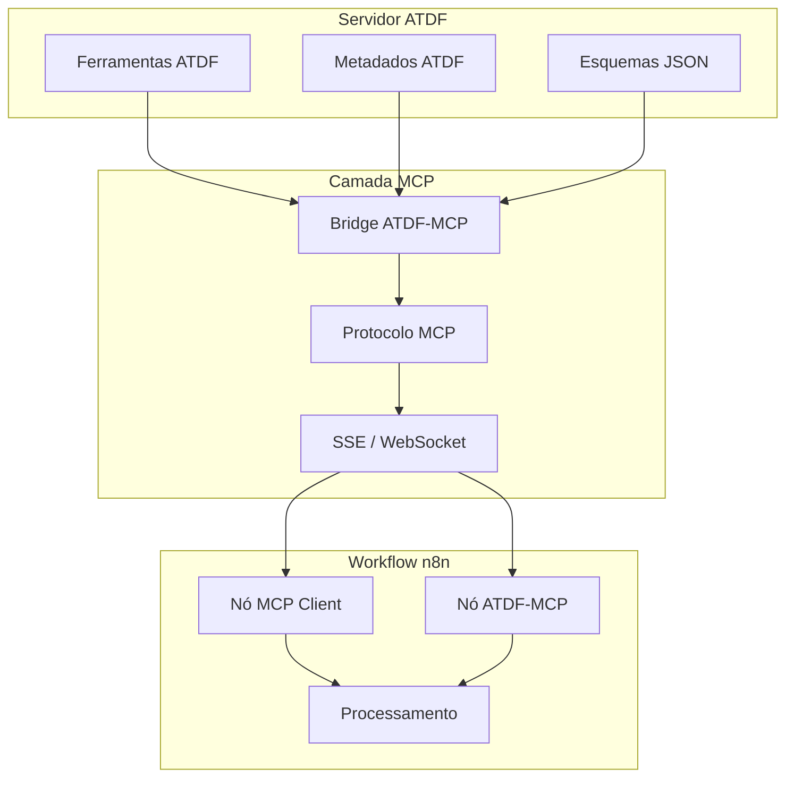

> **Selector Client links diretos:** [Guia de uso](../tool_selector.md#client-usage) | [README de workflows](../n8n-workflows/README.md#selector-client-quick-reference)

## Arquitetura de Integração



## Cenários de Uso

### 1. Utilizando nós MCP nativos do n8n

```json
{
  "nodes": [
    {
      "parameters": {
        "serverUrl": "http://localhost:8001/sse",
        "operation": "listTools"
      },
      "type": "n8n-nodes-base.mcpClient",
      "name": "Listar Ferramentas ATDF"
    },
    {
      "parameters": {
        "serverUrl": "http://localhost:8001/sse",
        "operation": "callTool",
        "toolName": "calculate_metrics",
        "arguments": {
          "data": "={{ $json.data }}"
        }
      },
      "type": "n8n-nodes-base.mcpClient",
      "name": "Executar Ferramenta ATDF"
    }
  ]
}
```

**Quando usar:** provas de conceito rápidas sem instalar nós adicionais.

### 2. Utilizando nós ATDF-MCP personalizados

```json
{
  "nodes": [
    {
      "parameters": {
        "operation": "listTools",
        "language": "pt",
        "includeMetadata": true
      },
      "type": "n8n-nodes-atdf-mcp.atdfMcpClient",
      "name": "Cliente ATDF Direto"
    },
    {
      "parameters": {
        "operation": "executeTool",
        "toolName": "process_data",
        "parameters": {
          "input": "={{ $json.input }}",
          "format": "json"
        },
        "language": "pt"
      },
      "type": "n8n-nodes-atdf-mcp.atdfMcpClient",
        "name": "Executar com Localização"
    }
  ]
}
```

**Quando usar:** você precisa dos metadados completos do ATDF (localização, pré-requisitos, feedback) dentro do n8n.

## Comparação dos Enfoques

| Enfoque | Benefícios |
|---------|------------|
| Nós MCP nativos | ✅ Zero instalação extra · ✅ Interoperabilidade MCP pura · ✅ Ideal para demos |
| Nós ATDF-MCP personalizados | ✅ Metadados ATDF completos · ✅ Localização automática · ✅ Validação embutida · ✅ UI adaptada ao ATDF |

## Fluxo de Dados

```
1. O servidor ATDF expõe ferramentas e metadados
2. O bridge traduz ATDF → MCP
3. O n8n consome MCP via SSE/WebSocket
4. Os nós executam ferramentas com parâmetros ATDF
5. As respostas enriquecidas retornam ao n8n para processamento
```

## Configuração Recomendada

### Projetos novos
- Instale o pacote `n8n-nodes-atdf-mcp`
- Configure o bridge com o endpoint do servidor ATDF
- Ative a localização caso o time seja multilíngue

```bash
# Bridge local rápido
python examples/fastapi_mcp_integration.py
python examples/mcp_atdf_bridge.py --port 8001 --atdf-server http://localhost:8000
```

### Projetos existentes
- Mantenha os nós MCP nativos e adicione o bridge ATDF-MCP
- Valide descritores com `tools/validator.py` antes de publicá-los
- Planeje migração gradual para os nós dedicados

## Recursos Relacionados
 - [Guia MCP para n8n (PT)](n8n_mcp_server_guide.md)
 - [Índice central n8n + MCP + ATDF](../n8n_mcp_atdf_index.md)
 - [API REST e Autenticação do n8n](../../n8n_setup_complete.md)
 - [Workflow Code v3 (n8n)](../../n8n-workflows/README.md)
 - [Guia rápido (ES)](../../GUIA_INTEGRACION_N8N.md)
 - [Compatibilidade de versões do ATDF](../web/versions.html)
 - Fluxo de referência: `examples/n8n_mcp_comparison_workflow.json`

