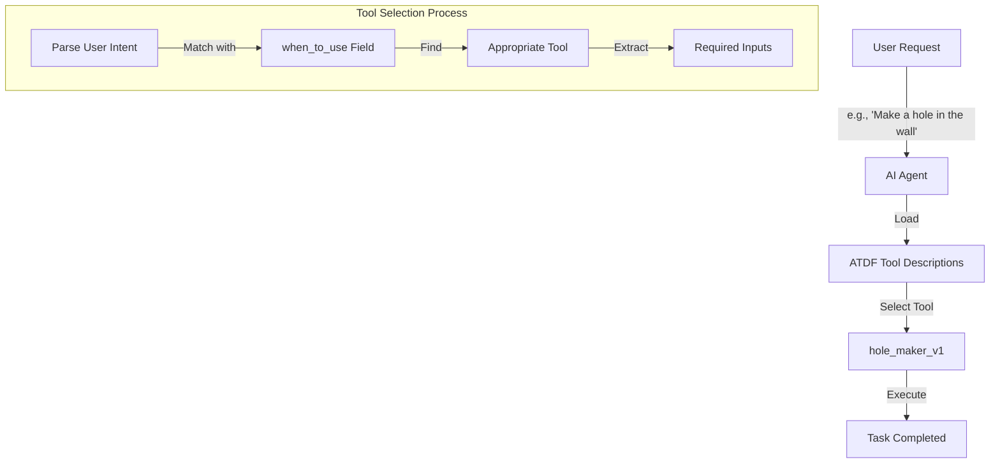
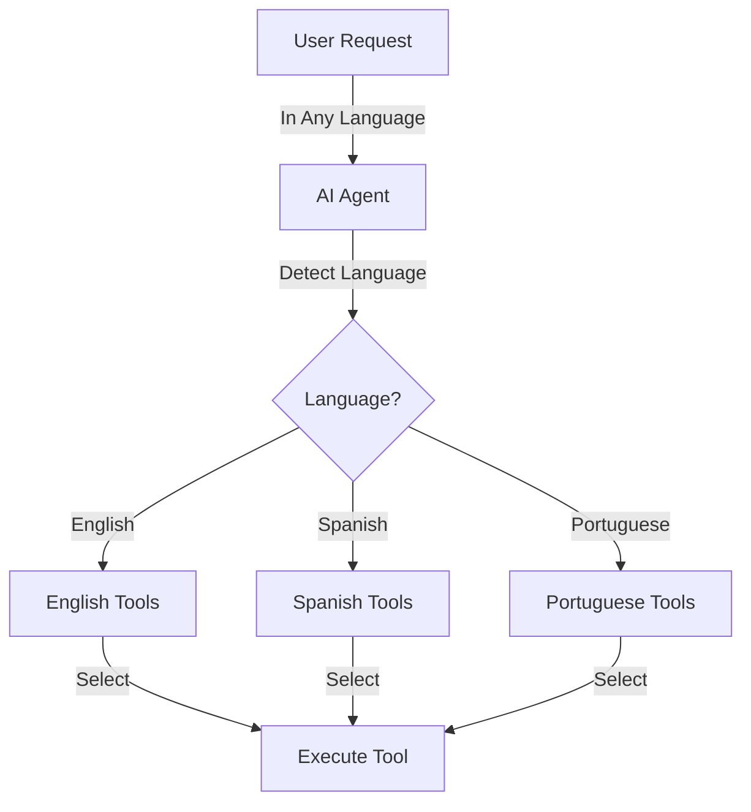
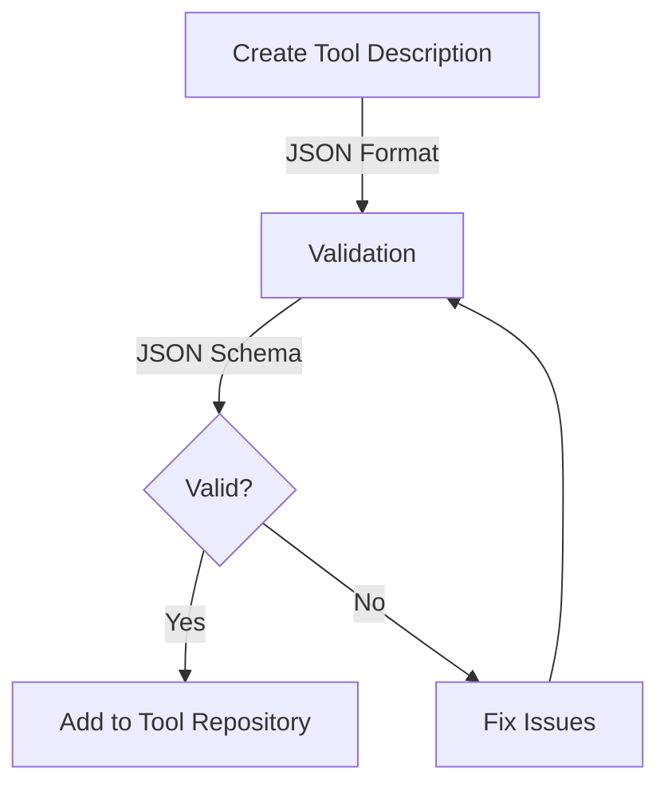
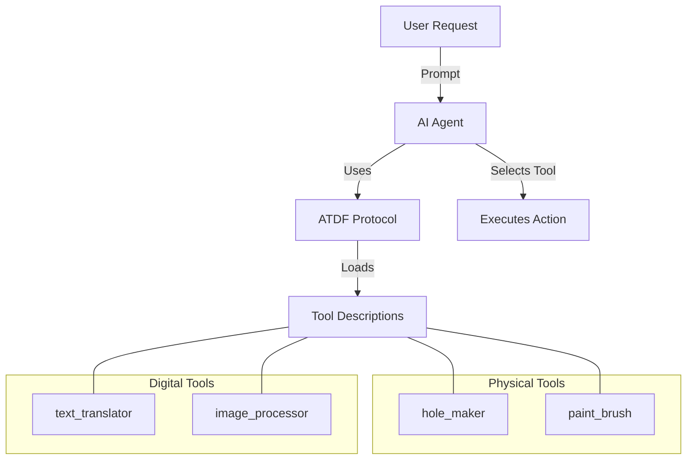
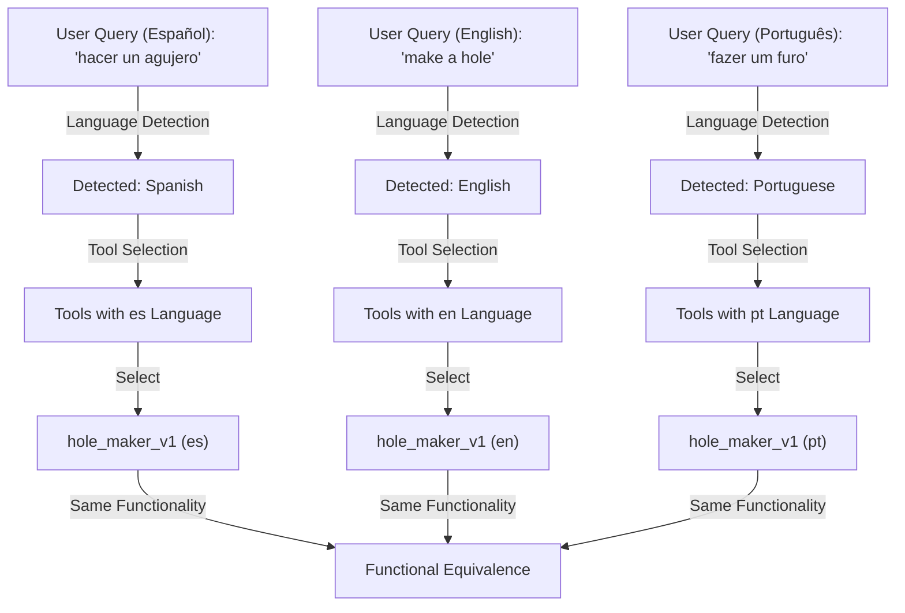

# ATDF Workflow

[Home](index.md) | [Specification](specification.md) | [Examples](examples.md) | [Contributing](contributing.md) | [Multilingual](multilingual.md) | [Workflow](workflow.md) | [Changelog](changelog.md) | [License](license.md)

This page illustrates how ATDF works in practice with Mermaid diagrams.

## Basic ATDF Flow

## Multilingual Tool Selection

## Tool Validation Process

## ATDF in Agent Ecosystem

## Cross-Language Interoperability

